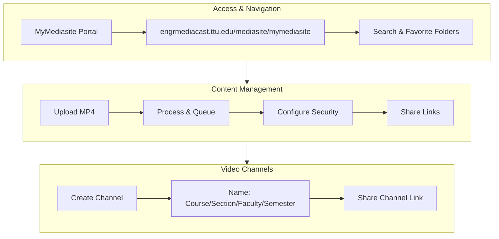
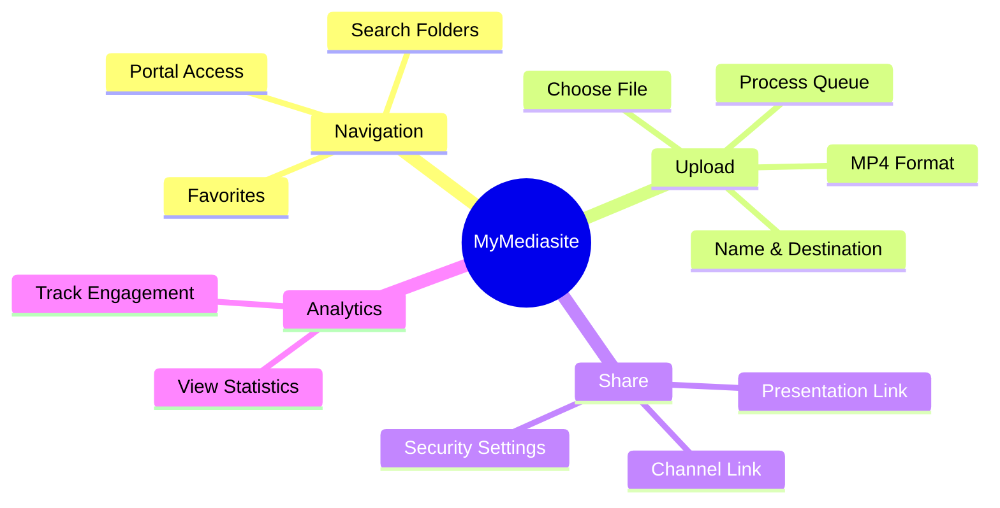

# MyMediasite Quick Steps Guide

> **Texas Tech University - Whitacre Online Learning Program**  
> Contact: online.learning.coe@ttu.edu

## Overview

MyMediasite is Texas Tech University's video presentation platform for creating, managing, and sharing educational video content. This guide covers essential workflows for instructors.

---

## 1. Locating a Shared Folder

To access course materials shared by colleagues:

| Step | Action | Description |
|------|--------|-------------|
| 1 | Navigate to portal | Go to [MyMediasite](https://engrmediacast.ttu.edu/mediasite/mymediasite) |
| 2 | Search | Type the instructor's last name in the search engine |
| 3 | Locate folder | Find the shared folder in results |
| 4 | Favorite | Click the star icon on the right side to add to favorites |

> **Tip:** Favorited folders appear on your home screen for quick access.

---

## 2. Adding a Presentation to a Shared Folder

To upload video content to a shared folder:

### Step-by-Step Instructions

1. **Select Upload**: Click "Choose File" to begin
2. **Browse Files**: Locate and select your presentation MP4 file
3. **Name Content**: Provide a descriptive name for the presentation
4. **Choose Destination**: Select the shared folder (default location)
5. **Create**: Click "Create Presentation"
6. **Wait for Processing**: The presentation will queue and process automatically
7. **Adjust Security**: Default setting is "private" — unlock to make viewable

---

## 3. Sharing a Presentation Link

To share individual presentations:

1. Select the target presentation
2. Click **"Share Presentation"**
3. Click **"Copy"** the quick link
4. Distribute the link to students

---

## 4. Creating and Sharing a Video Channel

Video channels organize multiple presentations for a course.

### Channel Creation

### Naming Convention

Use an identifiable naming pattern:

$$
\text{Channel Name} = \text{Course Number} + \text{Section} + \text{Faculty} + \text{Semester}
$$

**Example:** `CS5374-D01-Namin-Spring2026`

### Sharing the Channel

1. Select the channel
2. Click **"Share"**
3. Click **"Copy"** to copy the link
4. Distribute to students via Canvas or email

---

## 5. Viewing Analytics

Track student engagement with your content:

| Step | Action |
|------|--------|
| 1 | Select the presentation |
| 2 | Click **"View Analytics"** |
| 3 | Review viewing statistics and engagement data |

---

## Quick Reference Card

---

*Last Updated: Academic Year 2025-2026*
