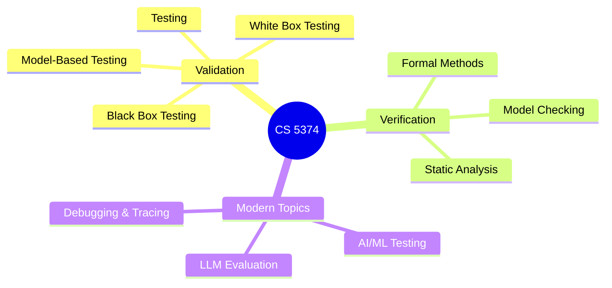
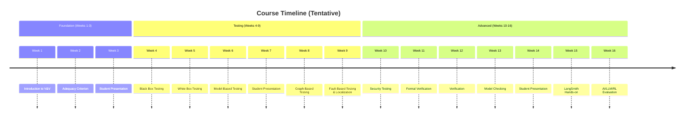
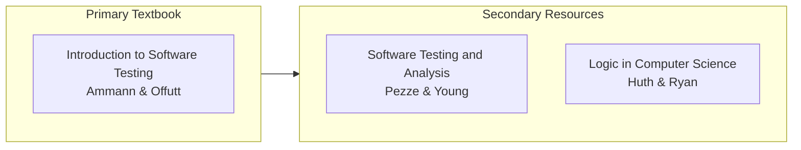
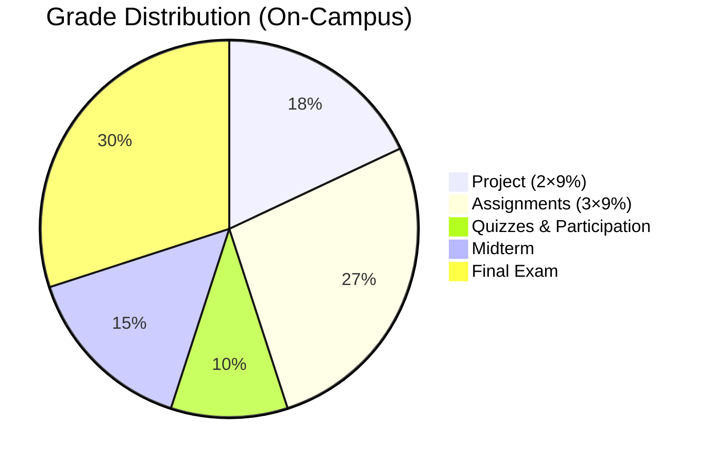
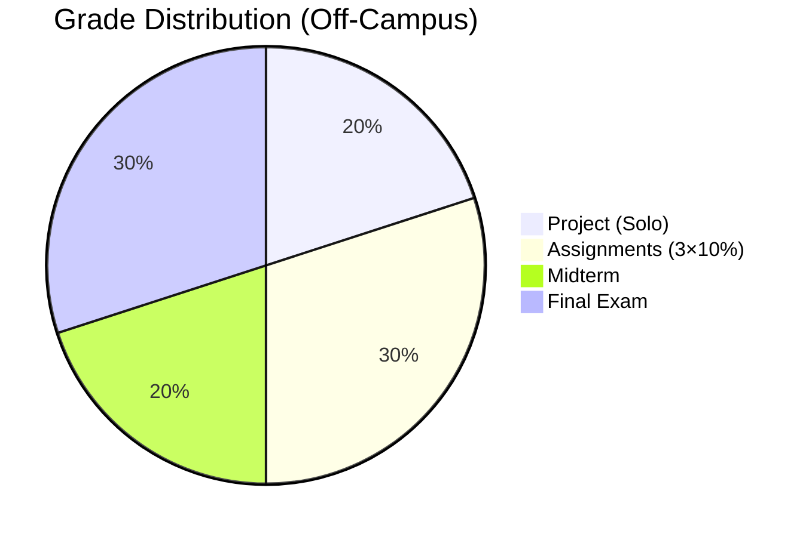
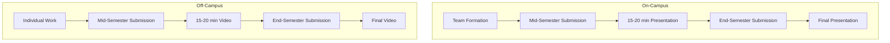

# CS 5374 – Software Verification and Validation

> **Texas Tech University**
> Department of Computer Science
> Spring 2026

---

## Course Overview

### Course Description

This course provides a comprehensive review of software **Validation and Verification (V&V)** techniques. Students will gain expertise in two complementary approaches:

$$
\text{Software Quality} = \text{Validation} + \text{Verification}
$$

| Approach | Definition | Focus |
|----------|------------|-------|
| **Validation** | "Are we building the right product?" | Testing, dynamic analysis |
| **Verification** | "Are we building the product right?" | Formal proofs, static analysis |

---

## Learning Objectives

Upon completion, students will be able to:

1. Apply black-box and white-box testing techniques
2. Generate test cases using adequacy criteria
3. Implement model-based and graph-based testing
4. Perform fault localization and fault-based testing
5. Apply formal verification methods including model checking
6. Evaluate AI/ML systems and Large Language Models (LLMs)

---

## Course Topics

### Detailed Topic List

**Foundations**
- Basic vocabulary of software quality and testing
- Validation vs. verification paradigms

**Testing Techniques**
- Black box and white box testing
- Functional vs. structural testing
- Adequacy criteria and graph coverage
- State-based specifications and FSM-based testing
- Object-Oriented program testing

**Advanced Topics**
- Security testing
- Fault localization
- Mutation testing

**Verification**
- Model checking
- Static analysis
- Logic-based verification

**Emerging Areas**
- AI/ML-based approaches to software testing
- LLM evaluation and debugging

---

## Prerequisites

| Requirement | Description |
|-------------|-------------|
| Programming | Knowledge of programming languages |
| Software Engineering | Familiarity with SE practices |

---

## Instructor Information

| | |
|---|---|
| **Name** | Dr. Akbar S. Namin |
| **Office** | 306G |
| **Office Hours** | Tuesdays 2:00 PM – 4:00 PM |
| **Email** | akbar.namin@ttu.edu |

---

## Required Resources

### Textbooks

| Textbook | Authors | Link |
|----------|---------|------|
| Introduction to Software Testing | Paul Ammann, Jeff Offutt | [Online Slides](https://cs.gmu.edu/~offutt/softwaretest/) |
| Software Testing and Analysis | Mauro Pezze, Michael Young | [Book Site](http://ix.cs.uoregon.edu/~michal/book/) |
| Logic in Computer Science | Michael Huth, Mark Ryan | — |

### AI/LLM Evaluation Resources

- [Introduction to Debugging and Testing LLMs in LangSmith](https://www.datacamp.com/tutorial/introduction-to-langsmith)
- [LangSmith Cookbook](https://github.com/langchain-ai/langsmith-cookbook)
- [Intro to LangSmith](https://github.com/langchain-ai/intro-to-langsmith)
- [LangSmith Evaluation Quickstart](https://docs.langchain.com/langsmith/evaluation-quickstart)

### Research Sources

- International Symposium on Software Testing and Analysis (ISSTA)
- International Conference on Software Testing (ICST)
- Journal of Software Testing, Verification, and Reliability (STVR)

---

## Grading Policy

### On-Campus Students

| Component | Weight | Details |
|-----------|--------|---------|
| Project | 18% | 2 submissions (9% each), 15-20 min presentation |
| Individual Assignments | 27% | 3 submissions (9% each) |
| Pop-up Quizzes | 10% | ~5 quizzes (2% each, adjusted) |
| Midterm Examination | 15% | Written examination |
| Final Examination | 30% | Comprehensive written exam |

$$
\text{Total} = 18\% + 27\% + 10\% + 15\% + 30\% = 100\%
$$

### Off-Campus (Distance) Students

| Component | Weight | Details |
|-----------|--------|---------|
| Project | 20% | Solo project, 2 submissions (10% each), 15-20 min video |
| Individual Assignments | 30% | 3 submissions (10% each) |
| Midterm Examination | 20% | Online examination |
| Final Examination | 30% | Online examination |

$$
\text{Total} = 20\% + 30\% + 20\% + 30\% = 100\%
$$

### Bonus Opportunities (Distance Students)

Distance students may earn bonus marks through optional quizzes:

$$
\text{Maximum Grade} = 100\% + 5\% \text{ (bonus)} = 105\%
$$

---

## Team-Based Projects

**Requirements:**
- Teams: 2-4 members (on-campus), solo (off-campus)
- Focus: Software testing and program analysis
- Deliverables: Code, documentation, and presentation/video

---

## Learning Outcomes

### Master of Science Degree

| LO | Outcome |
|----|---------|
| LO 1 | Communicate effectively orally and in writing |
| LO 2 | Engage in life-long learning and self-critique |
| LO 4 | Function independently on self-directed projects or research |

### Doctor of Philosophy Degree

| LO | Outcome |
|----|---------|
| LO 1 | Communicate effectively orally and in writing |
| LO 2 | Engage in life-long learning and self-critique |
| LO 3 | Function in multi-disciplinary, culturally diverse teams |

---

## Academic Integrity

### Policy Summary

$$
\text{Academic Dishonesty} = \text{Zero Tolerance}
$$

**Prohibited Actions:**
- Cheating on examinations
- Plagiarism (uncited use of others' work)
- Collusion on individual assignments
- Falsifying academic records

### Consequences

| Offense | Penalty |
|---------|---------|
| First Offense | Zero on assignment + possible suspension |

> **Important:** All assignments are individual work. You may discuss approaches, but implementation must be your own.

### Reference

Texas Tech University Student Handbook:
http://www.depts.ttu.edu/studentaffairs/publications/2008_2009_Handbook_and_Code.pdf (Part IX, pp. 21-30)

---

## Accommodations

Students with disabilities requiring accommodations should:

1. Contact Student Disability Services (West Hall)
2. Obtain appropriate verification
3. Present verification to instructor during office hours
4. Arrange accommodations before needed

**Contact:** 806-742-2405

---

## Tentative Schedule

| Week | Topic | Notes |
|------|-------|-------|
| 1 | Introduction to V&V | |
| 2 | Adequacy Criterion | |
| 3 | Student Presentation | |
| 4 | Black Box Testing | |
| 5 | White Box Testing | |
| 6 | Model-Based Testing | |
| 7 | Student Presentation | |
| 8 | Graph-Based Testing | |
| 9 | Fault-Based Testing & Localization | |
| 10 | Security Testing | |
| 11 | Formal Verification | |
| 12 | Verification | |
| 13 | Model Checking | |
| 14 | Student Presentation | |
| 15 | LangSmith + Hands-on | |
| 16 | AI/LLM/RL Evaluation | |

---

*Last Updated: Spring 2026*
