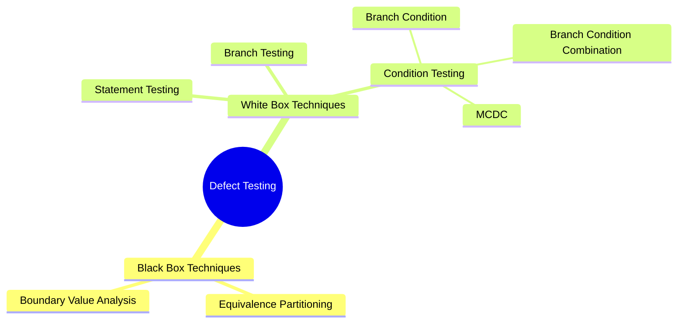
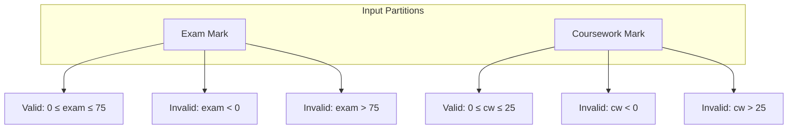
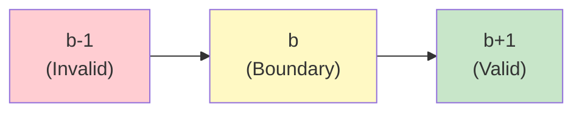
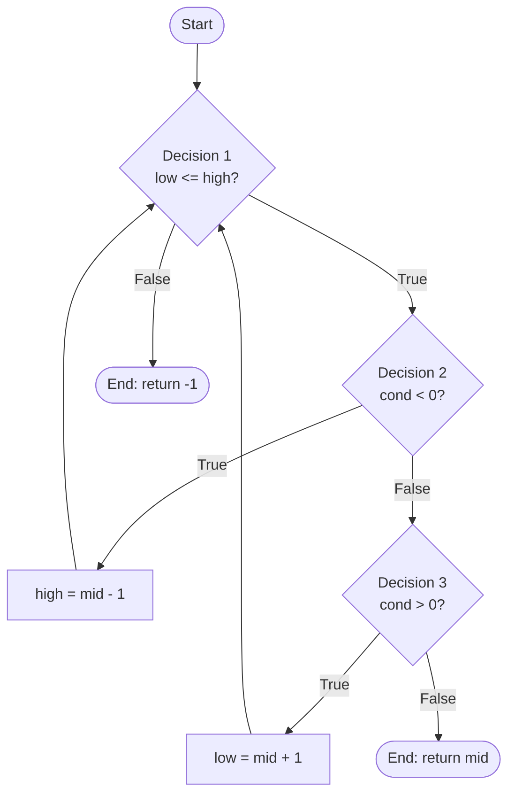
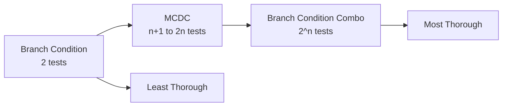
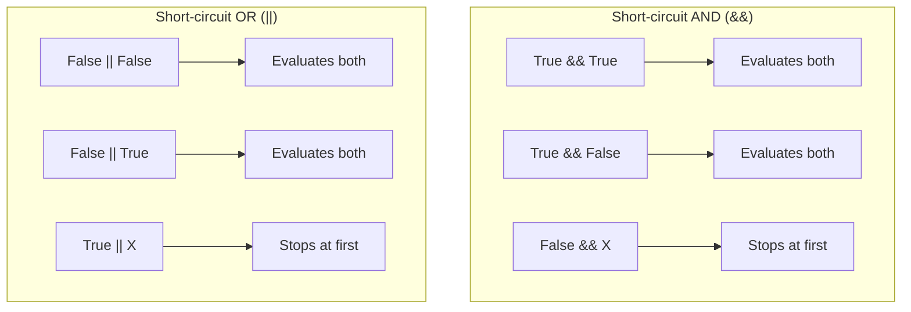

# Defect Testing: Black Box and White Box Techniques

> **CS 5374 – Software Verification and Validation**  
> Texas Tech University

---

## Overview

This chapter covers test data generation techniques for both black-box and white-box testing approaches.



---

# Part 1: Black Box Test Data Generation Techniques

---

## 1. Equivalence Partitioning (EP)

### 1.1 Introduction

**Equivalence partitioning** is based on the premise that inputs and outputs can be partitioned into classes that will be treated similarly by the component.

$$
\text{Testing one value from EP} \equiv \text{Testing entire partition}
$$

### 1.2 Example: Grade Generation Component

**Specification:**

> The component is passed an exam mark (out of 75) and a coursework mark (out of 25), generating a grade 'A' to 'D':
> 
> | Total Mark | Grade |
> |------------|-------|
> | $\geq 70$ | 'A' |
> | $50 \leq t < 70$ | 'B' |
> | $30 \leq t < 50$ | 'C' |
> | $< 30$ | 'D' |
> 
> Fault message ('FM') generated for out-of-range marks.

### 1.3 Identifying Equivalence Partitions



#### Input Partitions

| Variable | Valid | Invalid |
|----------|-------|---------|
| Exam Mark | $0 \leq e \leq 75$ | $e < 0$, $e > 75$ |
| Coursework | $0 \leq c \leq 25$ | $c < 0$, $c > 25$ |
| Non-integer | — | real number, alphabetic |

#### Output Partitions

| Grade | Condition | Type |
|-------|-----------|------|
| 'A' | $70 \leq t \leq 100$ | Valid |
| 'B' | $50 \leq t < 70$ | Valid |
| 'C' | $30 \leq t < 50$ | Valid |
| 'D' | $0 \leq t < 30$ | Valid |
| 'FM' | $t > 100$ or $t < 0$ | Valid (specified) |
| 'E', 'A+', 'null' | Unspecified | Invalid |

### 1.4 Test Case Generation

#### Approach 1: One-to-One

Each partition gets one dedicated test case.

| TC | Exam | CW | Total | Partition Tested | Expected |
|----|------|-----|-------|------------------|----------|
| 1 | 44 | 15 | 59 | $0 \leq e \leq 75$ | 'B' |
| 2 | -10 | 15 | 5 | $e < 0$ | 'FM' |
| 3 | 93 | 15 | 108 | $e > 75$ | 'FM' |
| 4 | 40 | 8 | 48 | $0 \leq c \leq 25$ | 'C' |
| 5 | 40 | -15 | 25 | $c < 0$ | 'FM' |
| 6 | 40 | 47 | 87 | $c > 25$ | 'FM' |

#### Approach 2: Minimized Test Set

Each test case hits multiple partitions.

| TC | Exam | CW | Total | Exam EP | CW EP | Total EP | Exp |
|----|------|-----|-------|---------|-------|----------|-----|
| 1 | 60 | 20 | 80 | $0 \leq e \leq 75$ | $0 \leq c \leq 25$ | $70 \leq t \leq 100$ | 'A' |
| 2 | 40 | 15 | 55 | $0 \leq e \leq 75$ | $0 \leq c \leq 25$ | $50 \leq t < 70$ | 'B' |
| 3 | 25 | 10 | 35 | $0 \leq e \leq 75$ | $0 \leq c \leq 25$ | $30 \leq t < 50$ | 'C' |
| 4 | 15 | 8 | 23 | $0 \leq e \leq 75$ | $0 \leq c \leq 25$ | $0 \leq t < 30$ | 'D' |
| 5 | -10 | -15 | -25 | $e < 0$ | $c < 0$ | $t < 0$ | 'FM' |

### 1.5 Comparison of Approaches

| Aspect | One-to-One | Minimized |
|--------|------------|-----------|
| **Test Cases** | More | Fewer |
| **Debugging** | Easier (isolated) | Harder (multiple changes) |
| **Cost** | Higher execution | Lower execution |

---

## 2. Boundary Value Analysis (BVA)

### 2.1 Introduction

BVA extends EP by focusing on **boundaries** where developers are prone to making errors.

$$
\text{Boundary Test Values} = \{b-1, b, b+1\}
$$



### 2.2 Example: Grade Component

#### Exam Mark Boundaries

| TC | Exam | CW | Boundary | Expected |
|----|------|-----|----------|----------|
| 1 | -1 | 15 | 0 (below) | 'FM' |
| 2 | 0 | 15 | 0 (on) | 'D' |
| 3 | 1 | 15 | 0 (above) | 'D' |
| 4 | 74 | 15 | 75 (below) | 'A' |
| 5 | 75 | 15 | 75 (on) | 'A' |
| 6 | 76 | 15 | 75 (above) | 'FM' |

#### Total Mark Boundaries

| TC | Exam | CW | Total | Boundary | Expected |
|----|------|-----|-------|----------|----------|
| 13 | -1 | 0 | -1 | 0 (below) | 'FM' |
| 14 | 0 | 0 | 0 | 0 (on) | 'D' |
| 15 | 0 | 1 | 1 | 0 (above) | 'D' |
| 16 | 29 | 0 | 29 | 30 (below) | 'D' |
| 17 | 15 | 15 | 30 | 30 (on) | 'C' |
| 18 | 6 | 25 | 31 | 30 (above) | 'C' |

### 2.3 Implementation-Dependent Boundaries

For 16-bit integers, additional boundaries exist:

$$
\text{INT\_MIN} = -32768, \quad \text{INT\_MAX} = 32767
$$

| TC | Exam | CW | Total | Boundary | Expected |
|----|------|-----|-------|----------|----------|
| 28 | 32766 | 15 | 32781 | INT_MAX (below) | 'FM' |
| 29 | 32767 | 15 | 32782 | INT_MAX (on) | 'FM' |
| 30 | 32768 | 15 | — | INT_MAX (above) | 'FM' |

---

# Part 2: White Box Test Data Generation Techniques

---

## 3. Statement Testing and Coverage

### 3.1 Definition

**Statement coverage** measures the percentage of executable statements exercised by test cases.

$$
\text{Statement Coverage} = \frac{\text{Statements Executed}}{\text{Total Statements}} \times 100\%
$$

### 3.2 What is a Statement?

A statement should be an **atomic action** — executed completely or not at all.

| Type | Executable? |
|------|-------------|
| Assignments | ✓ Yes |
| Loops/Selections | ✓ Yes |
| Procedure calls | ✓ Yes |
| Variable declarations (initialized) | ✓ Yes |
| Variable declarations (uninitialized) | ✗ No |

### 3.3 Example

```c
a;           // Statement 1
if (b) {     // Statement 2 (condition)
    c;       // Statement 3
}
d;           // Statement 4
```

**Coverage Analysis:**

| Test Case | b | Statements Covered | Coverage |
|-----------|---|-------------------|----------|
| 1 | TRUE | 1, 2, 3, 4 | 100% |
| 2 | FALSE | 1, 2, 4 | 75% |

> **Weakness:** 100% statement coverage can be achieved without testing all branches.

---

## 4. Branch (Decision) Testing and Coverage

### 4.1 Definition

**Branch coverage** requires each decision to evaluate to both TRUE and FALSE.

$$
\text{Branch Coverage} = \frac{\text{Branches Executed}}{\text{Total Branches}} \times 100\%
$$

### 4.2 Example: Binary Search

```c
int binsearch(char *word, struct key tab[], int n) {
    int cond, low, high, mid;
    low = 0;
    high = n - 1;
    while (low <= high) {                          // Decision 1
        mid = (low + high) / 2;
        if ((cond = strcmp(word, tab[mid].word)) < 0)  // Decision 2
            high = mid - 1;
        else if (cond > 0)                         // Decision 3
            low = mid + 1;
        else
            return mid;
    }
    return -1;
}
```

### 4.3 Control Flow Graph



### 4.4 Branch Coverage Analysis

| Branch | Count |
|--------|-------|
| Start → D1 | 1 |
| D1 True | 1 |
| D1 False | 1 |
| D2 True | 1 |
| D2 False | 1 |
| D3 True | 1 |
| D3 False | 1 |
| **Total** | **6 branches** |

### 4.5 Test Cases

| TC | word | tab | n | Path | Coverage |
|----|------|-----|---|------|----------|
| 1 | "chas" | empty | 0 | D1/False | 1/6 (17%) |
| 2 | "chas" | [alf,bert,chas,dick,eddy,fred,geoff] | 7 | D1/T, D2/T, D1/T, D2/F, D3/F | 5/6 (83%) |

---

## 5. Condition Testing and Coverage

### 5.1 Example Condition

```ada
if A or (B and C) then
    do_something;
else
    do_something_else;
end if;
```

### 5.2 Branch Condition Coverage (BCC)

Each Boolean operand evaluated both TRUE and FALSE.

| Case | A | B | C | Outcome |
|------|---|---|---|---------|
| 1 | FALSE | FALSE | FALSE | FALSE |
| 2 | TRUE | TRUE | TRUE | TRUE |

$$
\text{BCC requires: } 2 \text{ test cases (regardless of } n \text{ operands)}
$$

**Weakness:** Can be achieved without testing both branches.

### 5.3 Branch Condition Combination Coverage (BCCC)

All combinations of Boolean operands.

| Case | A | B | C | Outcome |
|------|---|---|---|---------|
| 1 | F | F | F | F |
| 2 | T | F | F | T |
| 3 | F | T | F | F |
| 4 | F | F | T | F |
| 5 | T | T | F | T |
| 6 | F | T | T | T |
| 7 | T | F | T | T |
| 8 | T | T | T | T |

$$
\text{BCCC requires: } 2^n \text{ test cases for } n \text{ operands}
$$

### 5.4 Modified Condition Decision Coverage (MCDC)

**MCDC** requires each operand to **independently** affect the outcome.

$$
\text{MCDC requires: } n+1 \text{ to } 2n \text{ test cases}
$$

#### MCDC Derivation for $A \lor (B \land C)$

**Step 1:** Show A independently affects outcome

| Case | A | B | C | Outcome |
|------|---|---|---|---------|
| A1 | F | F | T | F |
| A2 | T | F | T | T |

**Step 2:** Show B independently affects outcome

| Case | A | B | C | Outcome |
|------|---|---|---|---------|
| B1 | F | F | T | F |
| B2 | F | T | T | T |

**Step 3:** Show C independently affects outcome

| Case | A | B | C | Outcome |
|------|---|---|---|---------|
| C1 | F | T | T | T |
| C2 | F | T | F | F |

#### Final MCDC Test Set

| Case | A | B | C | Outcome | Proves |
|------|---|---|---|---------|--------|
| 1 | F | F | T | F | A (with 2), B (with 3) |
| 2 | T | F | T | T | A (with 1) |
| 3 | F | T | T | T | B (with 1), C (with 4) |
| 4 | F | T | F | F | C (with 3) |

### 5.5 Coverage Comparison

| Technique | Test Cases (n operands) | Thoroughness |
|-----------|------------------------|--------------|
| Branch Condition | 2 | Low |
| Branch Condition Combination | $2^n$ | Very High |
| MCDC | $n+1$ to $2n$ | High (practical) |



### 5.6 MCDC Application Note

MCDC is required for **avionics software** (RTCA/DO-178B standard).

---

## 6. Short-Circuit Evaluation Consideration

### 6.1 Definition

Some languages short-circuit Boolean evaluation:



### 6.2 Feasible Combinations

| Operator | Feasible Combinations |
|----------|----------------------|
| Short-circuit AND | TT, TF, FX |
| Short-circuit OR | FF, FT, TX |

> **Impact:** BCCC may not be measurable; MCDC and BCC still achievable.

---

## Summary

### Black Box vs White Box

| Aspect | Black Box | White Box |
|--------|-----------|-----------|
| **Basis** | Specifications | Code structure |
| **Techniques** | EP, BVA | Statement, Branch, MCDC |
| **Knowledge** | No code access | Code required |
| **Focus** | Functionality | Structure |

### Coverage Hierarchy

$$
\text{Statement Coverage} \subset \text{Branch Coverage} \subset \text{MCDC} \subset \text{BCCC}
$$

---

*CS 5374 – Software Verification and Validation | Texas Tech University*
