# Functional Testing

> **CS 5374 – Software Verification and Validation**  
> Texas Tech University

---

## Overview

**Functional Testing** focuses on verifying that software meets its functional requirements (specifications). Also known as:

- Black-box testing
- Specification-based testing
- Behavioral testing

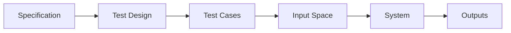

### Error Categories Targeted

| Category | Description |
|----------|-------------|
| 1 | Incorrect or missing functions |
| 2 | Interface errors |
| 3 | Data structure or external data access errors |
| 4 | Behavior or performance errors |
| 5 | Initialization and termination errors |

---

## Functional Testing Process

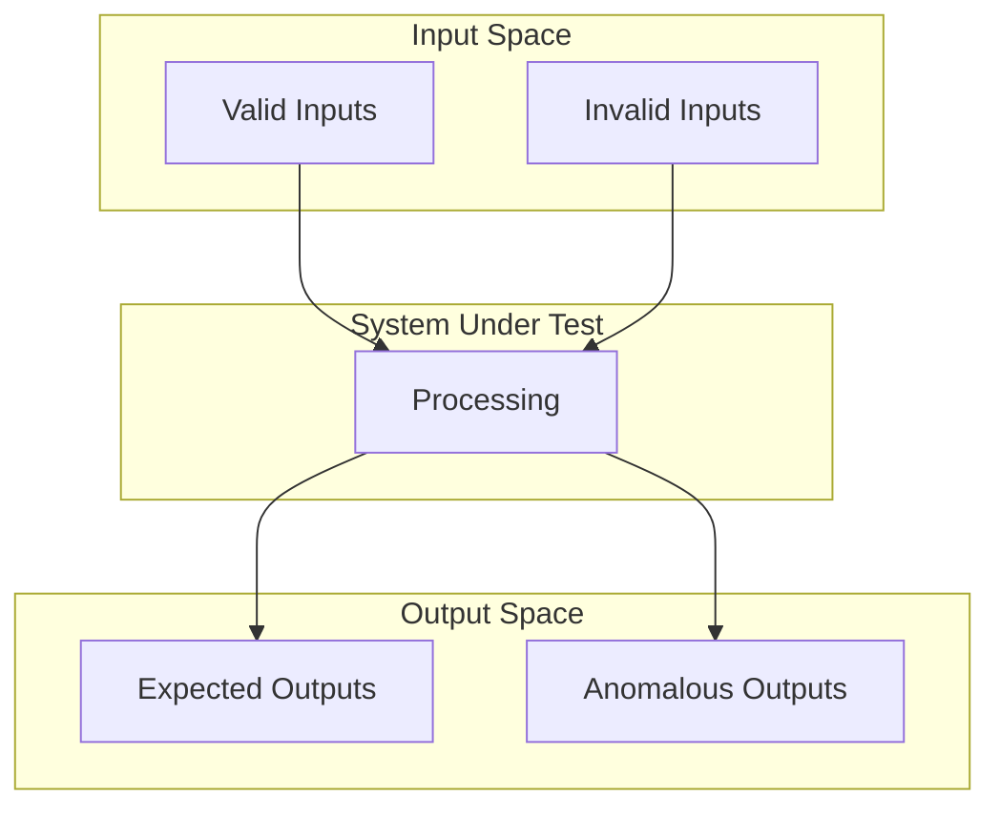

### Key Questions for Test Design

1. How is functional validity tested?
2. How is system behavior and performance tested?
3. What classes of input make good test cases?
4. How are data class boundaries isolated?

---

## Major Test Generation Methods

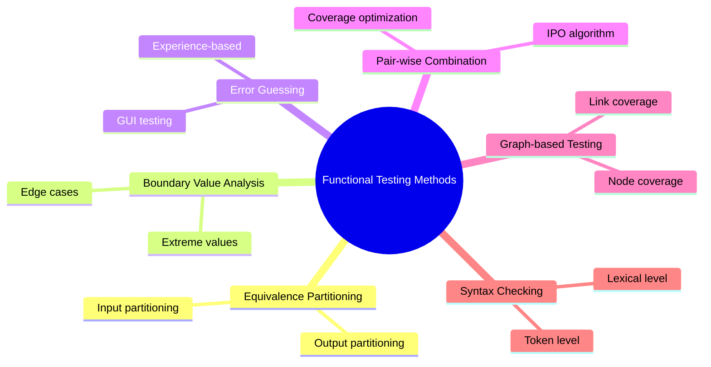

---

## 1. Equivalence Partitioning (EP)

### Definition

**Equivalence Partitioning** divides input data into classes where each class should be treated identically by the software.

$$
\text{Input Domain} = \bigcup_{i=1}^{n} E_i \quad \text{where } E_i \cap E_j = \emptyset
$$

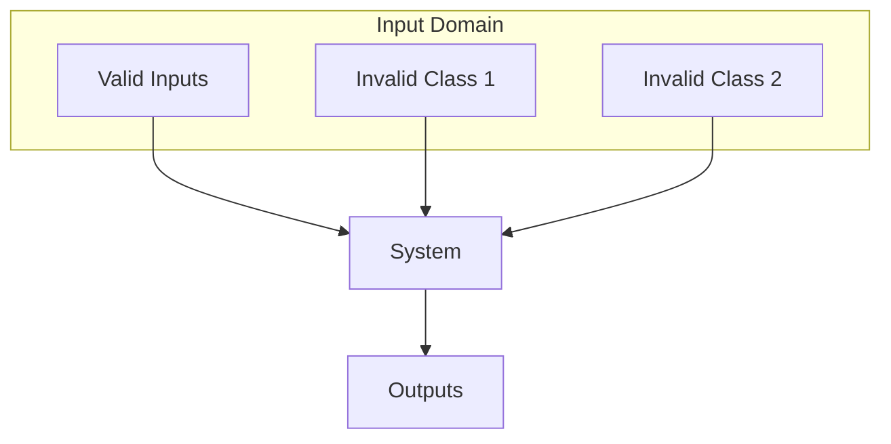

### Input Space Components

| Component | Examples |
|-----------|----------|
| **Sources of Inputs** | User input, GUI, disk files, network data |
| **Input Event Types** | Mouse movement, interrupts, pop-up menus |
| **Input Variables** | Phone numbers, names, license numbers |
| **Value Sets** | Valid ranges, invalid ranges |

### Value Set Examples

| Input | Valid Set | Invalid Sets |
|-------|-----------|--------------|
| Height | $\{x \mid x > 0\}$ | $\{x \mid x \leq 0\}$, non-numeric |
| City Name | alphabetic | alphanumeric, other |
| Unix filename | existing file | non-existent file |

> **Rule:** Number of invalid sets typically exceeds number of valid sets.

---

## EP Test Case Construction Rules

### Rule Summary

| Condition | Valid Classes | Invalid Classes |
|-----------|---------------|-----------------|
| **Range** $[a, b]$ | 1 | 2 |
| **Specific value** | 1 | 2 |
| **Set member** | 1 | 1 |
| **Boolean** | 1 | 1 |

### Detailed Guidelines

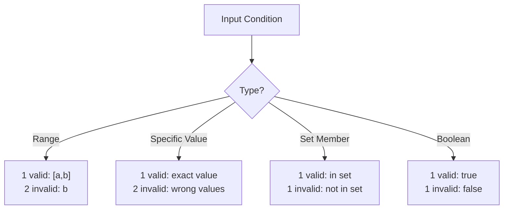

### Example: Search Routine

**Specification:**

```
procedure Search (key: ELEM; T: SEQ of ELEM; 
                  Found: in out BOOLEAN; L: in out ELEM_INDEX);

Pre-condition: T^FIRST <= T^LAST
Post-condition: (Found and T(L) = Key) or (not Found and key not in T)
```

**Equivalence Partitions:**

| Array Size | Element Position | Test Case |
|------------|------------------|-----------|
| Single value | In sequence | `[17]`, key=17 |
| Single value | Not in sequence | `[17]`, key=0 |
| Multiple values | First element | `[17,29,21,23]`, key=17 |
| Multiple values | Last element | `[41,18,9,31,30,16,45]`, key=45 |
| Multiple values | Middle element | `[17,18,21,23,29,41,38]`, key=23 |
| Multiple values | Not in sequence | `[21,23,29,33,38]`, key=25 |

---

## 2. Boundary Value Analysis (BVA)

### Concept

BVA extends equivalence partitioning by focusing on data at the **edges** of each class.

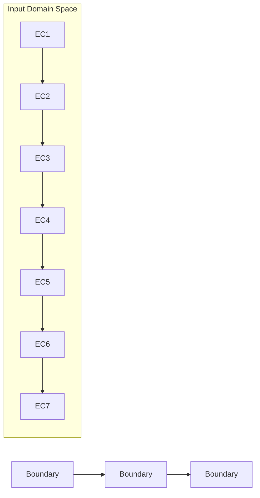

### Boundary Problem Types

| Problem | Description |
|---------|-------------|
| **Boundary Shift** | Where is the boundary between classes? |
| **Missing Boundary** | Does software implement the boundary? |
| **Extra Boundary** | Hidden boundaries not in spec? |
| **Closure Problem** | Which class contains boundary points? |

### BVA Guidelines

$$
\text{Boundary Tests} = \{a-1, a, a+1, b-1, b, b+1\}
$$

| Guideline | Test Values |
|-----------|-------------|
| Range $[a, b]$ | $a-1, a, a+1, b-1, b, b+1$ |
| Count $n$ | $n-1, n, n+1$ |
| Output range | Apply same to outputs |
| Data structures | Test array bounds |

### Example: Input Validation

**Specification:** Program accepts 4-10 inputs, each a 5-digit integer > 10000.

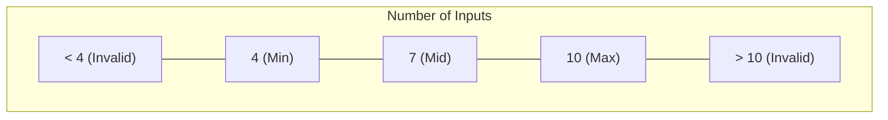

| Test Dimension | Invalid Low | Valid Min | Valid Mid | Valid Max | Invalid High |
|----------------|-------------|-----------|-----------|-----------|--------------|
| **Count** | 3 | 4 | 7 | 10 | 11 |
| **Value** | 9999 | 10000 | 50000 | 99999 | 100000 |

---

## 3. Error Guessing (EG)

### Concept

Error guessing relies on **experience and intuition** to anticipate where errors might occur.

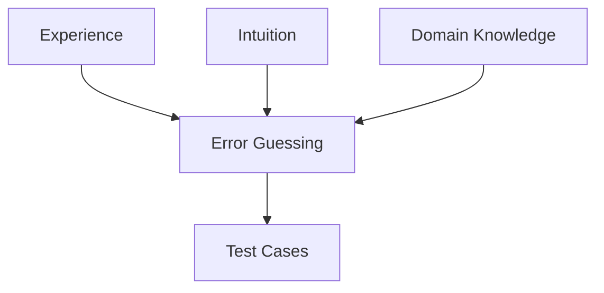

### Common Error Patterns

| Category | Examples |
|----------|----------|
| **Data Structures** | Empty list, single element, full capacity |
| **Numeric Values** | Zero, negative, very large, very small |
| **Strings** | Empty, special characters, Unicode |
| **GUI** | Invalid input type in field, rapid clicks |

### Linked List Example

- Add node to empty list
- Delete first node, then add first
- Delete last node, then add last
- Delete all nodes, then rebuild

---

## 4. Pair-wise Combination Testing

### Problem

Exhaustive testing of parameter combinations is often infeasible:

$$
\text{Exhaustive} = \prod_{i=1}^{n} |V_i|
$$

For 3 parameters with 3 values each: $3 \times 3 \times 3 = 27$ test cases.

### Solution: In-Parameter Order (IPO)

Generate test cases that cover all **pairs** of parameter values.

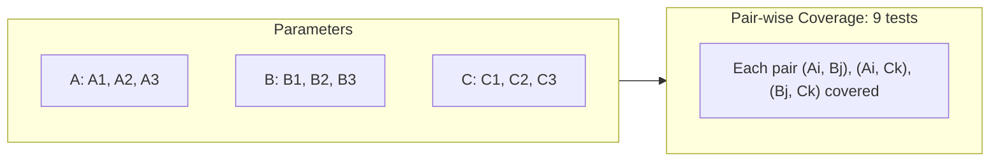

### IPO Algorithm Result

| Test | A | B | C |
|------|---|---|---|
| 1 | A1 | B1 | C1 |
| 2 | A1 | B2 | C2 |
| 3 | A1 | B3 | C3 |
| 4 | A2 | B1 | C2 |
| 5 | A2 | B2 | C3 |
| 6 | A2 | B3 | C1 |
| 7 | A3 | B1 | C3 |
| 8 | A3 | B2 | C1 |
| 9 | A3 | B3 | C2 |

**Coverage Guarantee:** All $(A_i, B_j)$, $(A_i, C_k)$, $(B_j, C_k)$ pairs covered.

---

## 5. Graph-Based Testing

### Concept

Model relationships between data objects and program objects as a graph.

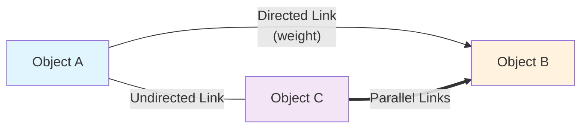

### Graph Components

| Component | Description |
|-----------|-------------|
| **Nodes** | Objects (data, screens, modules) |
| **Links** | Relationships between objects |
| **Node Weight** | Properties of a node |
| **Link Weight** | Characteristics of a link |

### Coverage Criteria

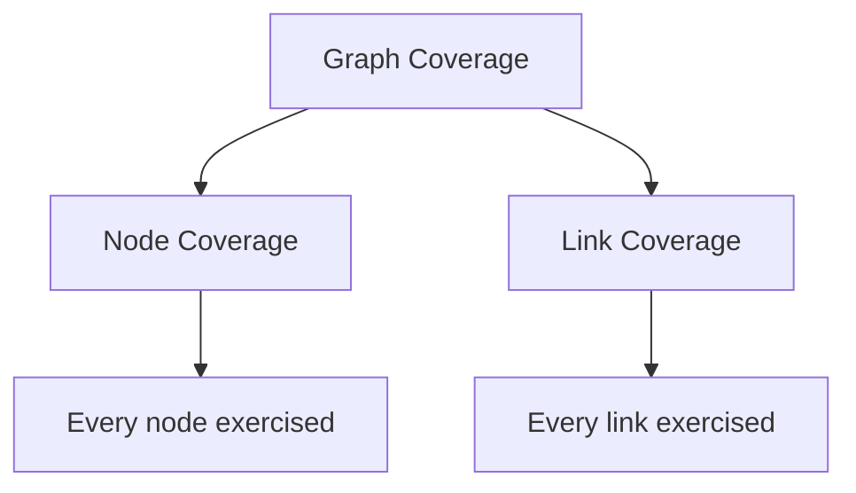

### Example: File Editor

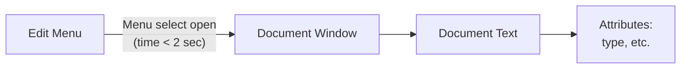

**Test Cases Derived:**
1. Select Edit → Open
2. Verify window opens < 2 seconds
3. Check document attributes

### Relationship Properties

| Property | Test Requirement |
|----------|------------------|
| **Transitivity** | $x R y, y R z \implies x R z$ |
| **Symmetry** | $x R y \implies y R x$ (bidirectional) |
| **Reflexivity** | $x R x$ (null/no action) |

---

## 6. Syntax Checking

### Concept

Test syntax validation at two levels:

| Level | Focus |
|-------|-------|
| **Token** | Keywords, numbers, operators |
| **Lexical** | Individual characters |

### Process

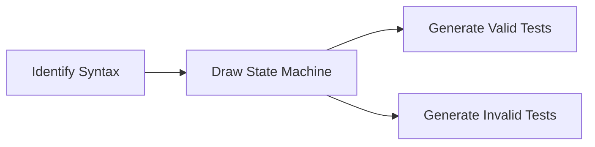

### Example: Unix `wc` Command

**Syntax:** `wc [-c | -m | -C] [-l] [-w] filename ...`

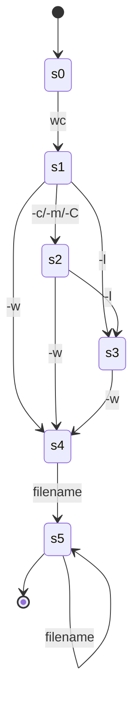

### Valid Syntax Testing

**All Transitions:**
- `wc foo`
- `wc foo1 foo2`
- `wc foo1 foo2 foo3`

**All Transition Pairs:**
- `wc -c foo`
- `wc -C -l foo`
- `wc -m -w foo`
- `wc -w foo`

### Invalid Syntax Testing

**Reaching Strings:** Strings that reach each state.

| State | Reaching String |
|-------|-----------------|
| s1 | `wc` |
| s2 | `wc -m` |
| s3 | `wc -l` |
| s4 | `wc -w` |

**Invalid Test Cases:**
- `wc -x -l -w foo` (invalid option -x)
- `wc -c -P foo` (invalid option -P)
- `wc -m -l -X foo` (invalid option -X)

### Lexical Level Testing

**Valid:** `wc`  
**Invalid:** `w`, `wcc`, `wcp`, `wc` (with special chars)

---

## Summary Comparison

| Method | Focus | Best For |
|--------|-------|----------|
| **EP** | Input classes | Reducing test count |
| **BVA** | Edge values | Finding boundary errors |
| **EG** | Experience-based | Exploratory testing |
| **Pair-wise** | Combinations | Multi-parameter systems |
| **Graph-based** | Relationships | Complex data flows |
| **Syntax** | Input validation | Command parsers |

---

## Key Takeaways

1. **Functional testing** is specification-based, not code-based
2. **Equivalence partitioning** reduces test cases while maintaining coverage
3. **Boundary values** are where errors cluster
4. **Error guessing** complements systematic methods
5. **Pair-wise testing** efficiently handles parameter combinations
6. **Graph-based testing** models complex relationships
7. **Syntax checking** validates input/output formats

---

*CS 5374 – Software Verification and Validation | Texas Tech University*
