# An Introduction to Software Testing

> **CS 5374 – Software Verification and Validation**
> Texas Tech University

---

## What is Software Testing?

Software testing is the process of executing a program with the intent of finding errors. Once source code is available, software must be tested to uncover and fix possible errors before delivery to the customer.

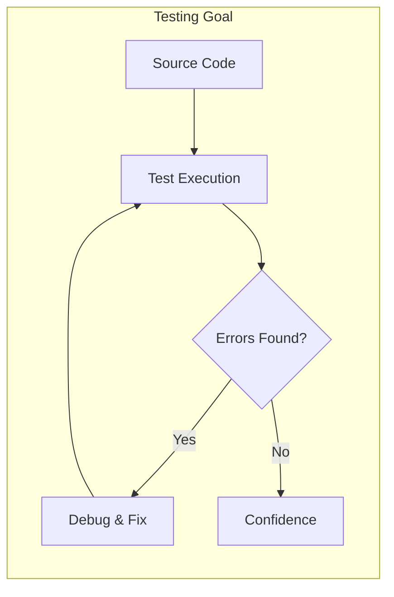

### Key Objectives

$$
\text{Testing Goal} = \max_{\text{test cases}} P(\text{finding errors})
$$

| Question | Answer |
|----------|--------|
| **What is it?** | Systematic execution to uncover errors before delivery |
| **Who does it?** | Software engineers and testing specialists |
| **Why is it important?** | Reviews and SQA are necessary but not sufficient |
| **What are the steps?** | Exercise requirements (functional) and internal logic (structural) |
| **What is the work product?** | Test cases with expected and actual results |

---

## Two Types of Program Analysis

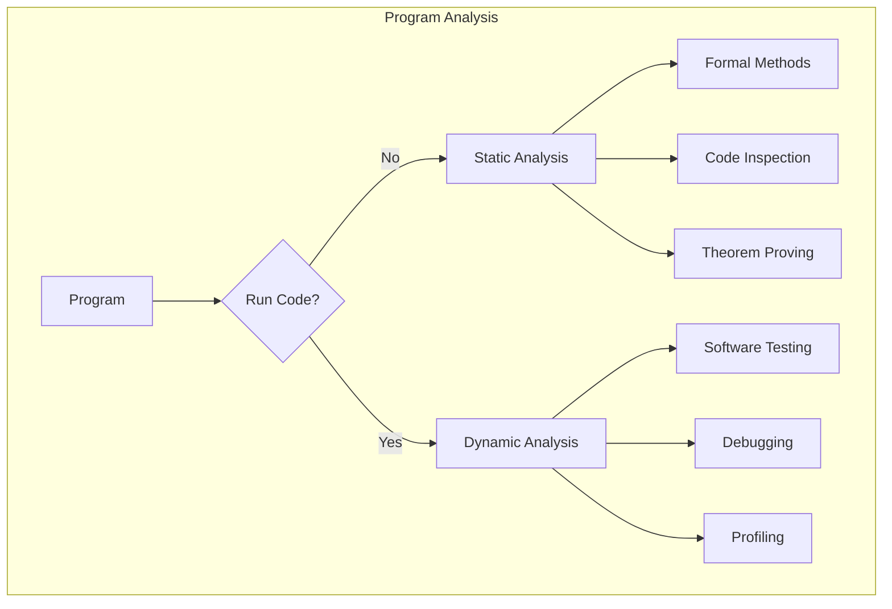

| Type | Description | When Applied |
|------|-------------|--------------|
| **Static Analysis** | Inspecting code without executing it | Before runtime |
| **Dynamic Analysis** | Inspecting code by executing it | During runtime |

---

## The Testing Process

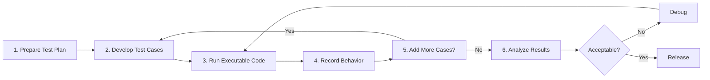

### The Major Question: When to Stop?

$$
\text{Stopping Criteria} = f(\text{Test Plan}, \text{Resources}, \text{Coverage}, \text{Risk})
$$

This is fundamentally an **optimization problem** and an active research direction.

---

## Testing Terminology

### Core Definitions

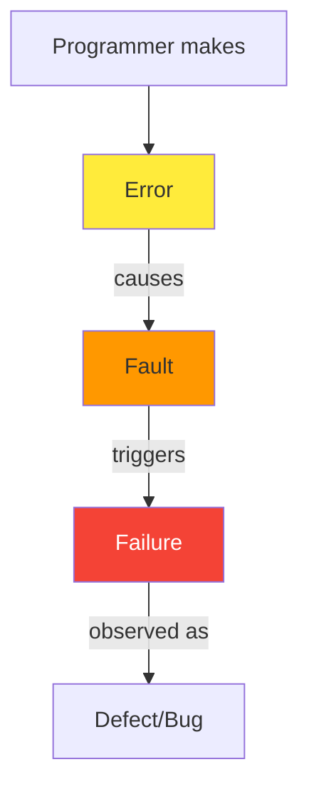

| Term | Definition | Example |
|------|------------|---------|
| **Error** | Mistake programmer made | Thinking `<` was correct when `<=` needed |
| **Fault** | Problem in code causing failure | Using `<` instead of `<=` |
| **Failure** | Incorrect program behavior | Producing wrong output |
| **Bug** | Informal term for fault/failure | "There's a bug in the code" |
| **Defect** | General term for any problem | Issues in specs, design, or code |

### Mathematical Relationship

$$
\text{Error} \xrightarrow{\text{introduces}} \text{Fault} \xrightarrow{\text{execution}} \text{Failure}
$$

---

## Test Case Components

A **test case** is the fundamental unit of testing:

$$
\text{Test Case} = \{\text{Test Input}, \text{Expected Output}, \text{Condition}\}
$$

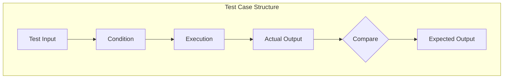

| Component | Description | Example |
|-----------|-------------|---------|
| **Test Input** | Data to run a test | `-l` in `ls -l` |
| **Expected Output** | What should happen | Long format listing |
| **Condition** | Precondition for test | Valid directory path |

### Test Outcomes

| Outcome | Definition |
|---------|------------|
| **Passing Test Case** | Software behaves as expected |
| **Failing Test Case** | Software behaves incorrectly |

---

## Test Organization

```mermaid
flowchart TB
    subgraph Pool["Test Pool']
        A["Test Suite A"]
        B["Test Suite B"]
    end

    A --> A1["Test Case 1"]
    A --> A2["Test Case 2"]
    A --> A3["Test Case 3"]

    B --> B1["Test Case n-1"]
    B --> B2["Test Case n"]
```

| Term | Definition |
|------|------------|
| **Test Suite** | A set of related test cases |
| **Test Pool** | All test cases developed |

---

## Test Equivalence

Two test cases are **test equivalent** if the software fails (or passes) on both.

### Equivalence Relation Properties

$$
\forall t_1, t_2, t_3 : t_1 \equiv t_2 \equiv t_3 \implies \text{same outcome}
$$

| Property | Mathematical Form | Meaning |
|----------|-------------------|---------|
| **Reflexivity** | $t R t$ | A test case is equivalent to itself |
| **Symmetry** | $t_1 R t_2 \implies t_2 R t_1$ | If $t_1$ fails, $t_2$ fails and vice versa |
| **Transitivity** | $t_1 R t_2 \land t_2 R t_3 \implies t_1 R t_3$ | Chain of equivalence |

---

## Test Infrastructure

### Test Oracle

A **test oracle** is a source of expected results for a test case.

### Test Driver

A "main program" that:
1. Accepts test case data
2. Passes data to the component under test
3. Prints relevant results

### Test Stub

A dummy subprogram that:
1. Replaces subordinate modules
2. Performs minimal data manipulation
3. Prints verification of entry
4. Returns control to the module under test

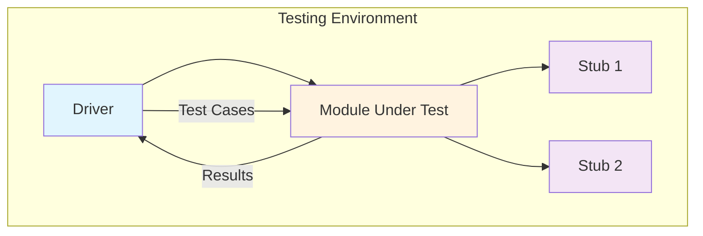

### Test Harness

A collection of software and test data configured to test a program unit under varying conditions while monitoring behavior.

---

## Testing Approaches

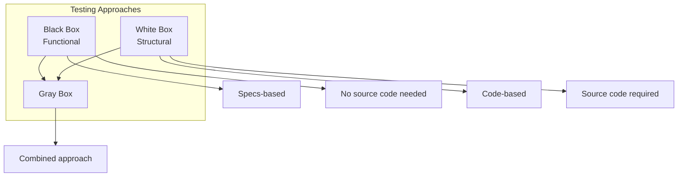

| Approach | Basis | Source Code |
|----------|-------|-------------|
| **Black Box (Functional)** | Specs, design docs, user manual | Not required |
| **White Box (Structural)** | Internal code structure | Required |
| **Gray Box** | Combination of both | Partial |

---

## Testing Levels

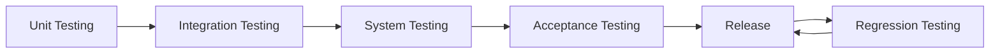

| Level | Scope | Purpose |
|-------|-------|---------|
| **Unit Testing** | Modules, routines, classes | Test individual components |
| **Integration Testing** | Multiple units | Test interactions |
| **System Testing** | Whole program | Test as complete system |
| **Acceptance Testing** | Complete system | Client approval |
| **Regression Testing** | Multiple releases | Ensure fixes don't break existing functionality |

### Alpha vs. Beta Testing

| Type | Location | Users |
|------|----------|-------|
| **Alpha Testing** | Developer's site | Real users |
| **Beta Testing** | User's site | Real users |

---

## Adequacy Criterion

A **test adequacy criterion** is a predicate that evaluates whether testing is sufficient:

$$
C: (\text{Program} \times \text{Test Suite}) \rightarrow \{\text{True}, \text{False}\}
$$

$$
C(P, T) = \begin{cases}
\text{True} & \text{if } T \text{ adequately tests } P \\
\text{False} & \text{otherwise}
\end{cases}
$$

---

## Verification vs. Validation

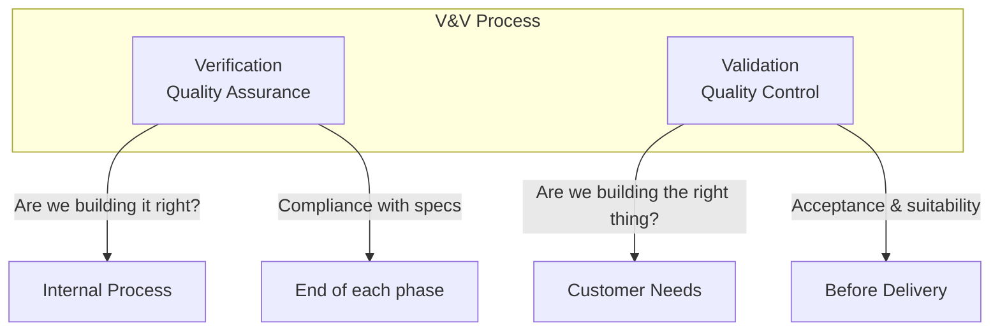

| Aspect | Verification (QA) | Validation (QC) |
|--------|-------------------|-----------------|
| **Question** | "Are we building it right?" | "Are we building the right thing?" |
| **Focus** | Process compliance | User requirements |
| **When** | End of each phase | Before delivery |
| **Audience** | Internal | External (customers) |

---

## V&V Planning Timeline

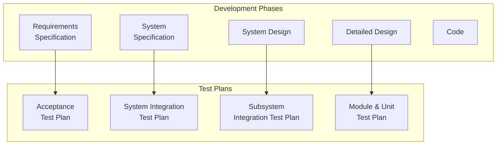

---

## Software Test Plan Structure

A comprehensive test plan should include:

| Section | Content |
|---------|---------|
| **Testing Process** | Description of major testing phases |
| **Requirements Traceability** | Mapping of requirements to test cases |
| **Tested Items** | Products to be tested |
| **Testing Schedule** | Timeline and resource allocation |
| **Test Recording Procedures** | How results are documented |
| **Hardware/Software Requirements** | Tools and resources needed |
| **Constraints** | Staff, time, budget limitations |

---

## Simple Testing Process Flow

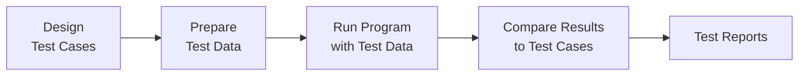

| Phase | Output |
|-------|--------|
| Design test cases | Test case specifications |
| Prepare test data | Test data sets |
| Run program | Test results |
| Compare results | Pass/Fail status |
| Document | Test reports |

---

## Summary: Test Case Generation Approaches

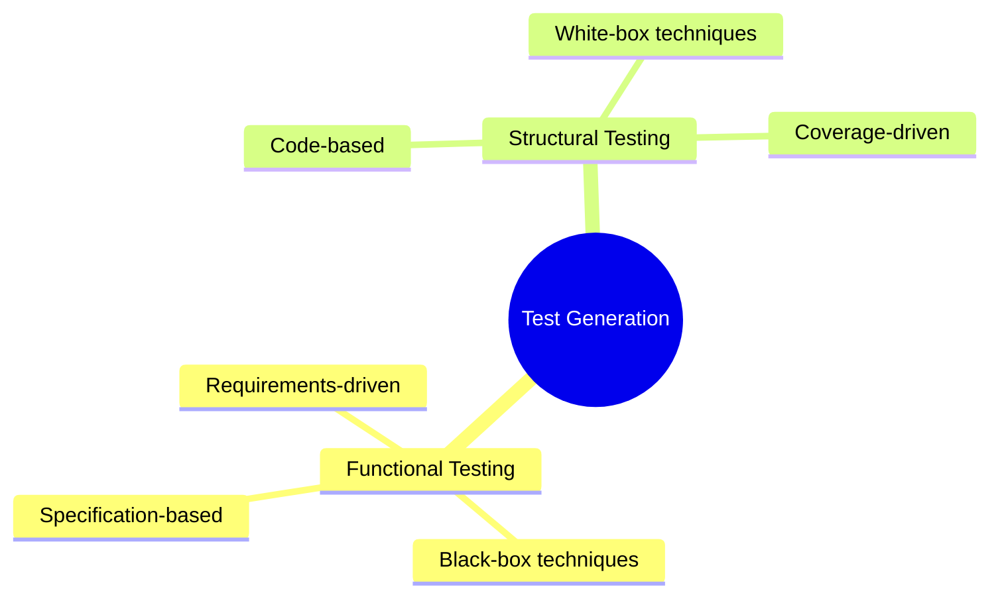

| Approach | Source | Techniques |
|----------|--------|------------|
| **Functional** | Program specification | Equivalence partitioning, Boundary analysis |
| **Structural** | Internal program logic | Statement, branch, path coverage |

---

## Key Takeaways

1. **Testing is essential** — Reviews alone are not sufficient
2. **Systematic approach** — Use disciplined techniques for thorough testing
3. **Multiple levels** — Unit → Integration → System → Acceptance
4. **Dual perspectives** — Functional (black-box) and Structural (white-box)
5. **Adequacy matters** — Define criteria to know when testing is complete

---

*CS 5374 – Software Verification and Validation | Texas Tech University*
