# Black-Box Testing Techniques

> **CS 5374 – Software Verification and Validation**  
> Texas Tech University

---

## Learning Objectives

After completing this chapter, you will understand:

1. Software testing as a V&V practice throughout the development lifecycle
2. Black-box and white-box testing fundamentals
3. Six types of software testing
4. Strategies for efficient test case design
5. Test case templates for repeatable testing

---

## 1. Introduction to Testing

### 1.1 Definition

**Software testing** is the process of analyzing a software item to detect differences between existing and required conditions (bugs) and to evaluate features of the software item.

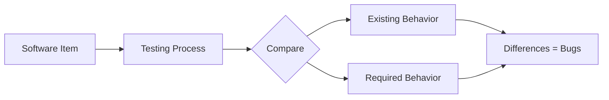

### 1.2 Verification vs. Validation

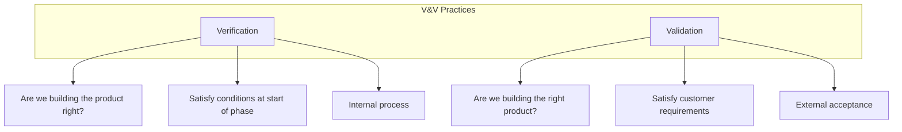

| Aspect | Verification | Validation |
|--------|--------------|------------|
| **Question** | "Are we building the product right?" | "Are we building the right product?" |
| **Focus** | Process compliance | Customer needs |
| **Timing** | End of each phase | Before delivery |
| **Activities** | Testing, reviews | Acceptance testing |

**Example (Monopoly Game):**
- **Verification**: Players cannot own the same house
- **Validation**: Landing on "Free Parking" gives collected money

---

## 2. Terminology

### 2.1 The Failure Progression

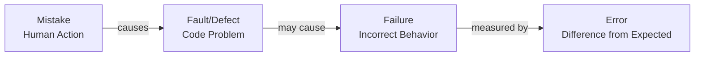

| Term | Definition | Example |
|------|------------|---------|
| **Mistake** | Human action producing incorrect result | Misunderstanding requirement |
| **Fault/Defect** | Incorrect step in program | Using `<` instead of `<=` |
| **Failure** | Inability to perform required function | Wrong output displayed |
| **Error** | Difference between computed and correct value | Off by one calculation |
| **Specification** | Document defining correct behavior | Requirements document |

### 2.2 Mathematical Model

$$
\text{Mistake} \xrightarrow{\text{introduces}} \text{Fault} \xrightarrow{\text{execution}} \text{Failure} \xrightarrow{\text{measures}} \text{Error}
$$

---

## 3. The Economics of Testing

### 3.1 Cost Analysis

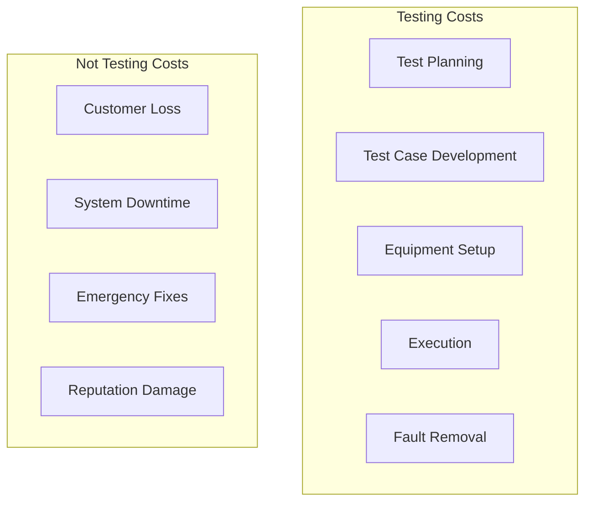

### 3.2 Risk-Based Testing

$$
\text{Test Investment} \propto \text{Risk Level} \times \text{Criticality}
$$

| Software Type | Testing Investment |
|---------------|-------------------|
| Video Games | Standard testing |
| Business Software | Enhanced testing |
| Safety-Critical (Aviation) | 3-5× all other SE steps combined |

### 3.3 Optimization Goal

$$
\max_{\text{test cases}} \frac{\text{Defects Found}}{\text{Testing Cost}}
$$

---

## 4. Testing Approaches

### 4.1 Black-Box vs. White-Box

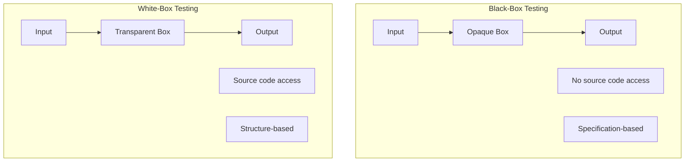

| Characteristic | Black-Box | White-Box |
|---------------|-----------|-----------|
| **Also Known As** | Functional, Behavioral | Structural, Glass Box |
| **Source Code** | Not accessible | Accessible |
| **Basis** | Specifications | Internal structure |
| **V&V Role** | Validation | Verification |
| **Typical Tester** | Independent tester | Developer |

---

## 5. Six Types of Testing

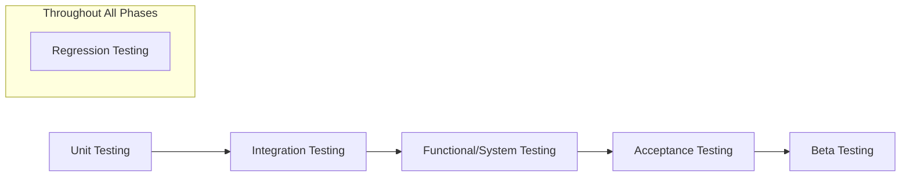

### 5.1 Unit Testing

| Attribute | Value |
|-----------|-------|
| **Opacity** | White-box |
| **Specification** | Low-level design, code structure |
| **Scope** | Individual units/classes |
| **Tester** | Programmer |

### 5.2 Integration Testing

| Attribute | Value |
|-----------|-------|
| **Opacity** | Black-box and white-box |
| **Specification** | High and low-level design |
| **Scope** | Multiple units |
| **Tester** | Programmer |

**Focus Areas:**
- Data loss across interfaces
- Message passing errors
- Interface implementation issues

### 5.3 Functional and System Testing

| Attribute | Value |
|-----------|-------|
| **Opacity** | Black-box |
| **Specification** | Requirements specification |
| **Scope** | Complete system |
| **Tester** | Independent tester |

**System Testing Types:**

| Type | Purpose | Example |
|------|---------|---------|
| **Stress Testing** | Evaluate beyond limits | 30+ cash registers simultaneously |
| **Performance Testing** | Meet performance requirements | Price lookup < 1 second |
| **Usability Testing** | User interaction quality | HCI specialist observation |

### 5.4 Acceptance Testing

| Attribute | Value |
|-----------|-------|
| **Opacity** | Black-box |
| **Specification** | Requirements specification |
| **Scope** | Customer environment |
| **Tester** | Customer |

**Key Points:**
- Customer reserves right to refuse delivery
- Often pre-specified by customer
- Should be run internally before delivery

### 5.5 Regression Testing

$$
\text{Regression Test Suite} \subset \text{Original Test Cases}
$$

**Selection Guidelines:**
1. Representative sample of all functions
2. Focus on changed components
3. Focus on affected functions

**Smoke Tests:** Subset to establish system stability

### 5.6 Beta Testing

| Attribute | Value |
|-----------|-------|
| **Opacity** | Black-box |
| **Specification** | Ad hoc |
| **Scope** | Customer environment |
| **Tester** | Real users |

**Advantages:**
- Unexpected error discovery
- Wide variety of environments
- Low cost

**Disadvantages:**
- Lack of systematic testing
- Low quality error reports
- Effort to examine reports

---

## 6. Testing Summary Table

| Testing Type | Specification | Scope | Opacity | Tester |
|--------------|--------------|-------|---------|--------|
| Unit | Low-level design, code | Single class | White-box | Programmer |
| Integration | High/low-level design | Multiple classes | Both | Programmer |
| Functional | High-level design | Whole product | Black-box | Independent |
| System | Requirements | Whole product | Black-box | Independent |
| Acceptance | Requirements | Customer env. | Black-box | Customer |
| Beta | Ad hoc | Customer env. | Black-box | Customer |
| Regression | Changed docs | Any level | Both | Both |

---

## 7. Test Planning

### 7.1 Test Plan Components

A **test plan** should include:

1. **Scope** — What is being tested
2. **Approach** — How testing will be done
3. **Resources** — Personnel and equipment
4. **Schedule** — Timeline for activities
5. **Test Items** — Products to test
6. **Features** — What to test
7. **Tasks** — Who does what
8. **Risks** — Contingency plans

### 7.2 Test Case Definition

$$
\text{Test Case} = \{\text{Inputs}, \text{Conditions}, \text{Expected Results}\}
$$

---

## 8. Black-Box Testing Process

### 8.1 Overview

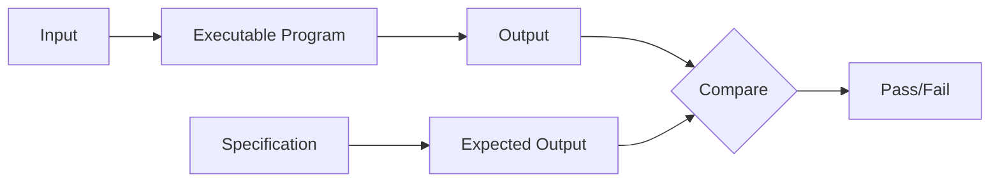

### 8.2 Error Categories

Black-box testing attempts to find:

1. **Incorrect or missing functionality**
2. **Interface errors**
3. **Data structure errors**
4. **Behavior/performance errors**
5. **Initialization/termination errors**

---

## 9. Test Case Anatomy

### 9.1 Template

| Test ID | Description | Expected Results | Actual Results |
|---------|-------------|------------------|----------------|
| Unique identifier | Steps and inputs | Expected output | Pass/Fail + details |

### 9.2 Good vs. Poor Test Cases

**Poor Example:**

| Test ID | Description | Expected Results | Actual Results |
|---------|-------------|------------------|----------------|
| 1 | Player 1 rolls dice and moves | Player 1 moves on board | |

**Good Example:**

| Test ID | Description | Expected Results | Actual Results |
|---------|-------------|------------------|----------------|
| 3 | Precondition: Test mode, SimpleGameBoard, 2 players, $1200 each Player 1 dice roll: 3 | Player 1 located at Blue 3 | |

### 9.3 Key Principles

$$
\text{Good Test Case} = \text{Specific} + \text{Repeatable} + \text{Verifiable}
$$

**Preconditions** define what must be true before test execution.

---

## 10. Black-Box Testing Strategies

### 10.1 Requirements-Based Testing

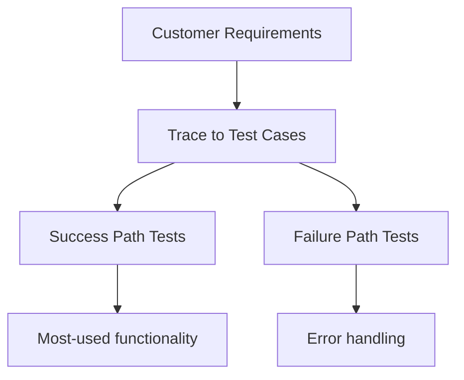

**Guidelines:**
1. Every requirement tested at least once
2. Start with most-used success paths
3. Include failure paths for error handling
4. Test risky requirements first

### 10.2 Equivalence Partitioning

Divides input domain into classes where each class should produce the same result.

$$
\text{Input Domain} = \bigcup_{i=1}^{n} E_i \quad \text{where } E_i \cap E_j = \emptyset \text{ for } i \neq j
$$

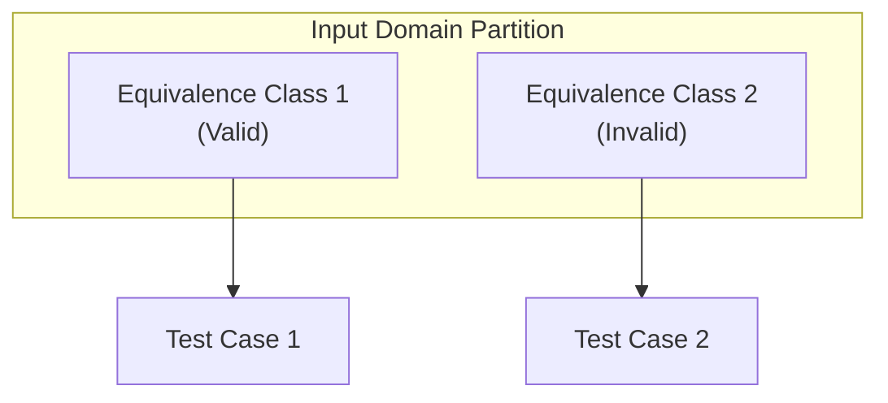

**Example — Player Money for Jail Fine:**

| Equivalence Class | Boundary | Behavior |
|-------------------|----------|----------|
| $< \$50$ | Invalid | Player out of game |
| $\geq \$50$ | Valid | Pay fine, continue |

**Guidelines:**

1. **Range values** → One valid, one or two invalid classes
2. **Specific values** → Valid set and invalid set
3. **Set membership** → One valid, one invalid class

### 10.3 Boundary Value Analysis

Errors often occur at boundaries. Test at:

$$
\text{Boundary Tests} = \{min, min-1, min+1, max, max-1, max+1\}
$$

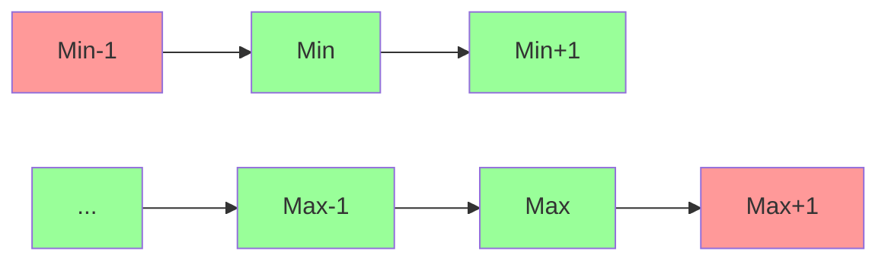

**For the $50 fine example:**

| Test Case | Player Money | Expected Result |
|-----------|--------------|-----------------|
| Boundary-1 | $49 | Out of game |
| Boundary | $50 | Pay $50, continue |
| Boundary+1 | $51 | Pay $50, $1 remains |

---

## 11. Key Takeaways

1. **Test early and often** — Find faults when they're cheapest to fix
2. **Use independent testers** — Avoid developer bias
3. **Write repeatable tests** — Clear, specific descriptions
4. **Apply equivalence partitioning** — Reduce redundancy
5. **Test boundaries** — Where errors cluster
6. **Plan iteratively** — Update tests as requirements change

---

## Quick Reference

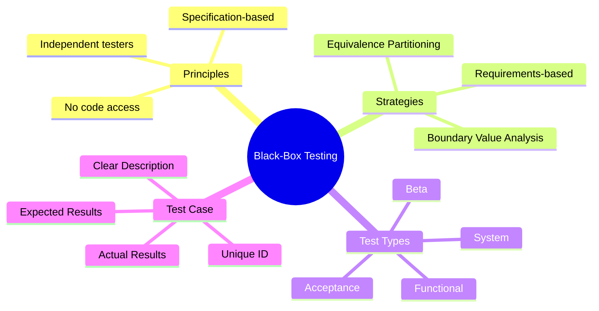

---

*CS 5374 – Software Verification and Validation | Texas Tech University*
