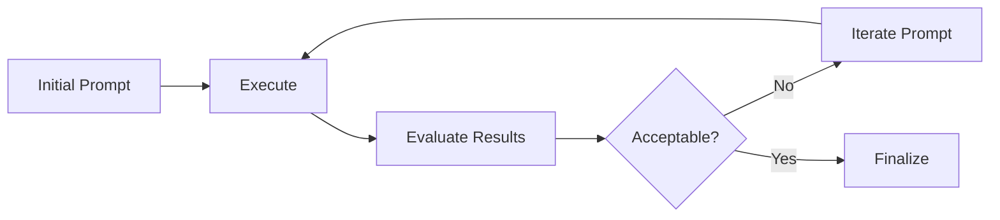
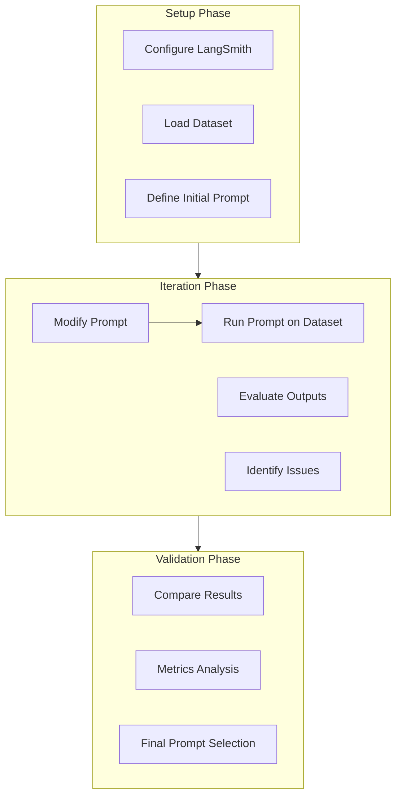

# LangSmith Prompt Iteration

> **CS 5374 – Software Verification and Validation**  
> Texas Tech University

---

## Overview

This module covers prompt iteration using LangSmith for LLM evaluation and debugging.



---

## Reference Resource

**Primary Notebook:**

$$
\text{URL: } \texttt{https://github.com/langchain-ai/langsmith-cookbook/blob/main/testing-examples/movie-demo/prompt\_iteration.ipynb}
$$

---

## Prompt Iteration Process

### Step-by-Step Workflow



---

## Key Concepts

### Prompt Template

A structured prompt with variable placeholders:

$$
\text{Prompt} = f(\text{context}, \text{input}, \text{instructions})
$$

### Evaluation Metrics

| Metric | Description |
|--------|-------------|
| **Accuracy** | Correctness of response |
| **Relevance** | Alignment with query |
| **Coherence** | Logical consistency |
| **Completeness** | Coverage of requirements |

---

## Running the Notebook

### Prerequisites

```bash
pip install langchain langsmith
```

### Configuration

```python
import os

os.environ["LANGCHAIN_TRACING_V2"] = "true"
os.environ["LANGCHAIN_API_KEY"] = "your-api-key"
os.environ["LANGCHAIN_PROJECT"] = "prompt-iteration"
```

### Execution Steps

| Step | Action |
|------|--------|
| 1 | Open `updated_small_prompt_iteration.ipynb` |
| 2 | Set environment variables |
| 3 | Run cells sequentially |
| 4 | Analyze results in LangSmith |
| 5 | Iterate on prompt design |

---

## Files in This Module

| File | Description |
|------|-------------|
| `info.pdf` | Reference information |
| `info.txt` | URL reference |
| `Instructions.docx` | Execution instructions |
| `updated_small_prompt_iteration.ipynb` | Main Jupyter notebook |

---

## Expected Outcomes

After completing this module, you will be able to:

1. Configure LangSmith for prompt iteration
2. Execute prompt variations on datasets
3. Evaluate and compare prompt effectiveness
4. Iterate to improve prompt performance

---

*CS5374 – Software Verification and Validation | Texas Tech University*
