# CS 5374 – Software Verification and Validation

> **Texas Tech University**  
> Department of Computer Science  
> Spring 2026

---

## Course Navigation

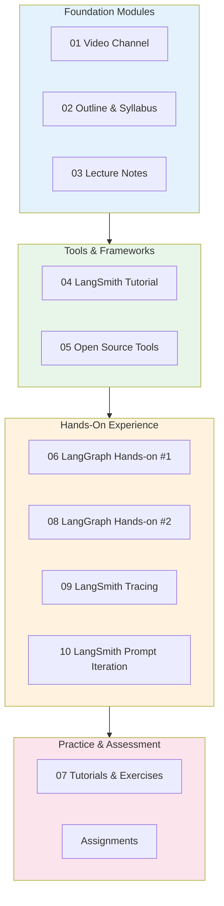

---

## Course Overview

### Learning Objectives

$$
\text{Course Goal} = \text{Validation} + \text{Verification} + \text{AI/LLM Evaluation}
$$

| Objective | Description |
|-----------|-------------|
| **Validation** | Testing techniques to ensure software meets requirements |
| **Verification** | Formal methods to prove correctness |
| **AI/LLM Evaluation** | Modern approaches to testing AI-powered applications |

### Key Topics

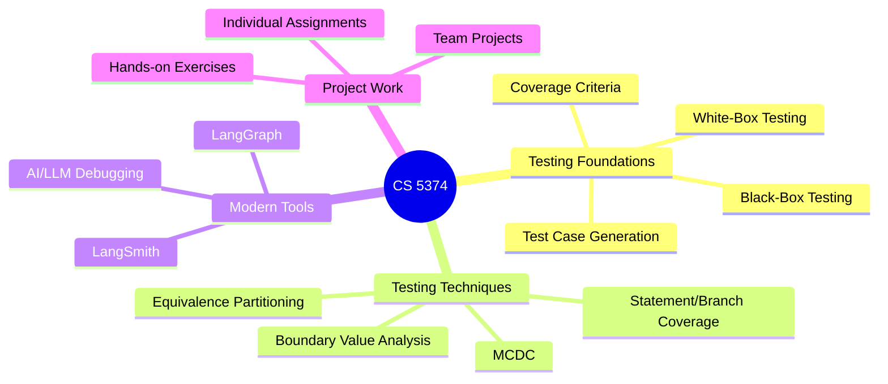

---

## Module Index

| Module | Title | Description | Files |
|--------|-------|-------------|-------|
| [01](#module-01--video-channel) | Video Channel | MyMediasite setup guide | 2 |
| [02](#module-02--outline--syllabus) | Outline & Syllabus | Course policies and schedule | 2 |
| [03](#module-03--lecture-notes-software-testing) | Lecture Notes | Core testing concepts | 8 |
| [04](#module-04--langsmith-tutorial) | LangSmith Tutorial | LLM evaluation framework | 21 |
| [05](#module-05--open-source-tools) | Open Source Tools | Frameworks and projects | 2 |
| [06](#module-06--langgraph-hands-on-1) | LangGraph Hands-on #1 | First LangGraph exercises | 6 |
| [07](#module-07--tutorials--exercises) | Tutorials & Exercises | Practice materials | 4 |
| [08](#module-08--langgraph-hands-on-2) | LangGraph Hands-on #2 | Advanced LangGraph | 7 |
| [09](#module-09--langsmith-tracing) | LangSmith Tracing | Tracing and debugging | 4 |
| [10](#module-10--langsmith-prompt-iteration) | Prompt Iteration | Prompt optimization | 6 |

---

## Module Details

### Module 01 – Video Channel

**Purpose:** Guide for using Texas Tech's MyMediasite platform for video content.

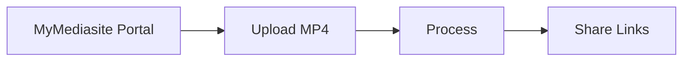

| File | Description |
|------|-------------|
| `My Mediasite Quick Steps 25-26.md` | Formatted guide |
| `My Mediasite Quick Steps 25-26.pdf` | Original PDF |

[↑ Back to Index](#module-index)

---

### Module 02 – Outline & Syllabus

**Purpose:** Course policies, grading, and schedule.

#### Grading Distribution

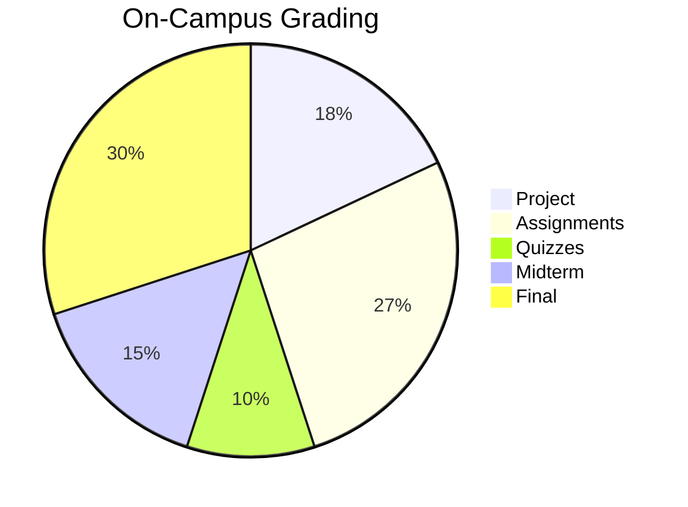

$$
\text{Total} = 18\% + 27\% + 10\% + 15\% + 30\% = 100\%
$$

| File | Description |
|------|-------------|
| `CS5374-SoftwareVerificationandValidation-TTU-CS-Spring2026.md` | Full syllabus |
| `CS5374-SoftwareVerificationandValidation-TTU-CS-Spring2026.pdf` | Original PDF |

[↑ Back to Index](#module-index)

---

### Module 03 – Lecture Notes: Software Testing

**Purpose:** Core testing theory and techniques.

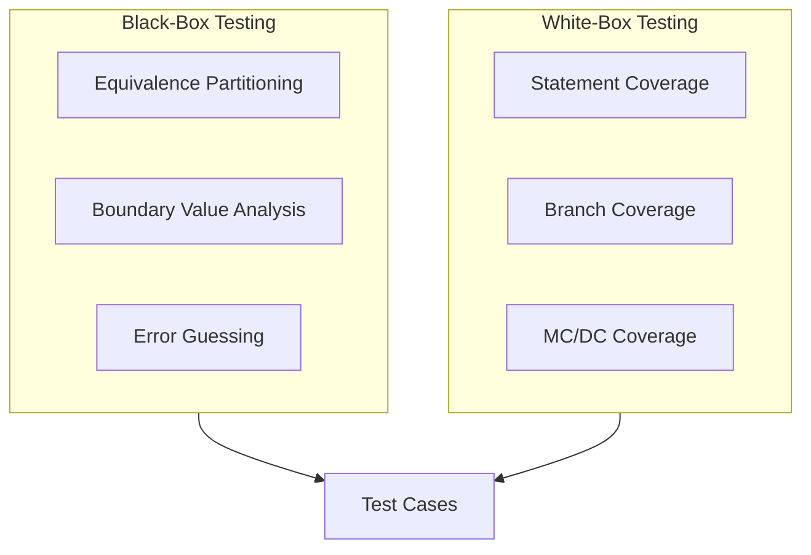

#### Coverage Hierarchy

$$
\text{Statement} \subset \text{Branch} \subset \text{MCDC} \subset \text{Condition Combination}
$$

| File | Topic |
|------|-------|
| `Introduction to Testing.md` | Testing fundamentals |
| `BlackBox.md` | Black-box techniques |
| `Functional Testing.md` | Functional test generation |
| `12_Defect_Testing_handout.md` | Defect testing methods |

[↑ Back to Index](#module-index)

---

### Module 04 – LangSmith Tutorial

**Purpose:** Introduction to LangSmith for LLM evaluation.

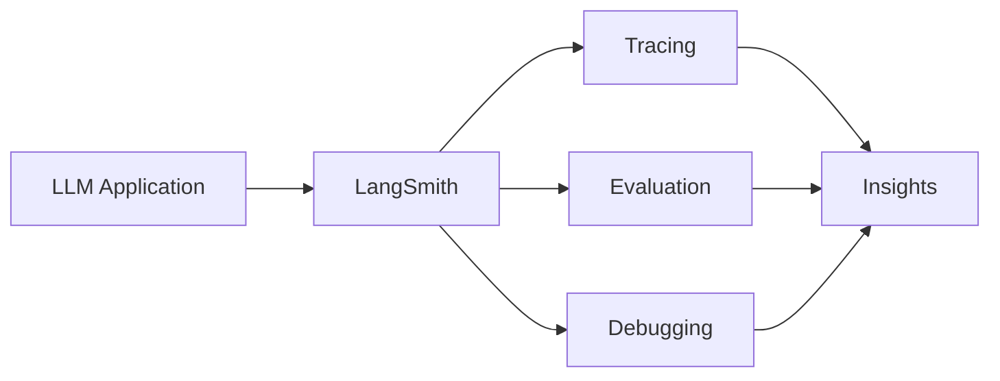

#### Project Structure

```
langsmith/
├── eli5/           # Simple explanation project
│   ├── eli5.py
│   └── eli5_complete.ipynb
├── react-agent/    # ReAct agent implementation
│   └── src/react_agent/
└── requirements.txt
```

| File | Description |
|------|-------------|
| `LangSmith.md` | Tutorial overview |
| `v0.1_LangSmith_Setup_Instructions-v1.md` | Setup guide |
| `langsmith/` | Project files |

[↑ Back to Index](#module-index)

---

### Module 05 – Open Source Tools

**Purpose:** Collection of testing frameworks and tools.

| File | Description |
|------|-------------|
| `Collection_of_frameworks_tools_projects.md` | Tools overview |

[↑ Back to Index](#module-index)

---

### Module 06 – LangGraph Hands-on #1

**Purpose:** First hands-on experience with LangGraph.

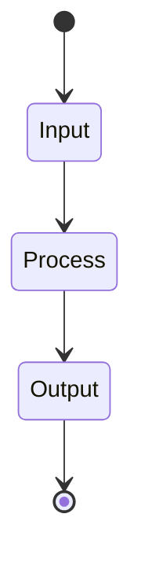

| File | Description |
|------|-------------|
| `LangGraph - Example 1.md` | Example walkthrough |
| `LangGraph_HandsOn - 1 Instruction.md` | Instructions |
| `langgraph_demo1.py` | Demo code |
| `LangGraph-Handson 1 Output.png` | Expected output |

[↑ Back to Index](#module-index)

---

### Module 07 – Tutorials & Exercises

**Purpose:** Practice exercises for testing techniques.

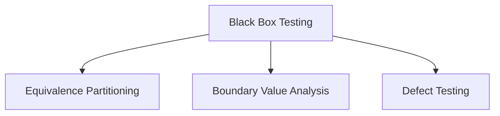

| File | Description |
|------|-------------|
| `BlackBox.md` | Black-box exercises |
| `12_Defect_Testing_handout.md` | Defect testing practice |

[↑ Back to Index](#module-index)

---

### Module 08 – LangGraph Hands-on #2

**Purpose:** Advanced LangGraph with LangSmith integration.

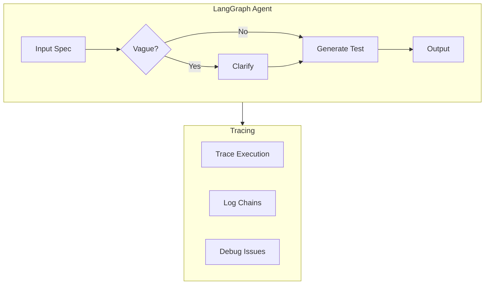

| File | Description |
|------|-------------|
| `LangGraph_Demo2.py` | Basic demo |
| `LangGraph_Demo2_LangSmith.py` | With tracing |
| `LangGraph_HandsOn_with_Demo_Code.md` | Instructions |
| `Screenshot*.png` | Output examples |

[↑ Back to Index](#module-index)

---

### Module 09 – LangSmith Tracing

**Purpose:** Tracing and debugging LLM applications.

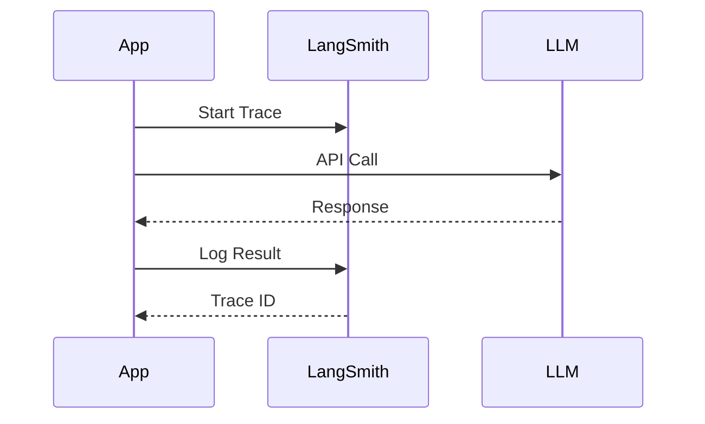

| File | Description |
|------|-------------|
| `LangSmith.md` | Tracing guide |
| `Screenshot*.png` | Tracing examples |

[↑ Back to Index](#module-index)

---

### Module 10 – LangSmith Prompt Iteration

**Purpose:** Prompt optimization and evaluation.

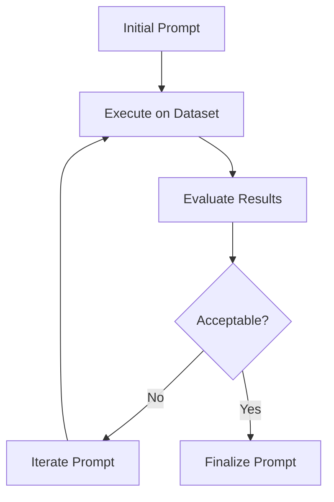

#### Key Concepts

| Concept | Description |
|---------|-------------|
| **Dataset** | Test inputs for evaluation |
| **Evaluator** | Function to score outputs |
| **Prompt Hub** | Version control for prompts |

| File | Description |
|------|-------------|
| `info.md` | Reference links |
| `Instructions.md` | Execution guide |
| `updated_small_prompt_iteration.ipynb` | Main notebook |

[↑ Back to Index](#module-index)

---

## Supporting Directories

### Archives

| File | Description |
|------|-------------|
| `langsmith.zip` | Original LangSmith project archive |

### Assignments

| File | Description | Due Date |
|------|-------------|----------|
| `Assignment1-CS5374-Spring2026.md` | Functional + Structural Testing | Feb 28 |
| `Quiz1.md` | LangGraph Vague Spec Agent | Completed |

### Code Repository

| File | Description |
|------|-------------|
| `langgraph_demo1.py` | Demo 1 source code |
| `LangGraph_Demo2.py` | Demo 2 source code |
| `LangGraph_Demo2_LangSmith.py` | Demo 2 with LangSmith |

### Notebooks

| File | Description |
|------|-------------|
| `updated_small_prompt_iteration.ipynb` | Prompt iteration notebook |

### Submissions

| File | Description |
|------|-------------|
| `annotated-PROJECT_PROPOSAL.md.pdf` | Project proposal submission |

---

## Quick Reference

### Testing Formulas

| Concept | Formula |
|---------|---------|
| **Statement Coverage** | $\frac{\text{Statements Executed}}{\text{Total Statements}} \times 100\%$ |
| **Branch Coverage** | $\frac{\text{Branches Executed}}{\text{Total Branches}} \times 100\%$ |
| **EP Test Cases** | One per equivalence class |
| **BVA Boundary Tests** | $\{b-1, b, b+1\}$ for each boundary |
| **MCDC Test Cases** | $n+1$ to $2n$ for $n$ Boolean operands |

### File Type Guide

| Extension | Location |
|-----------|----------|
| `.md` | All modules (formatted documentation) |
| `.pdf` | Original course materials |
| `.py` | `code/` and module directories |
| `.ipynb` | `notebooks/` and module directories |
| `.png` | Screenshots and diagrams |

---

## Course Schedule

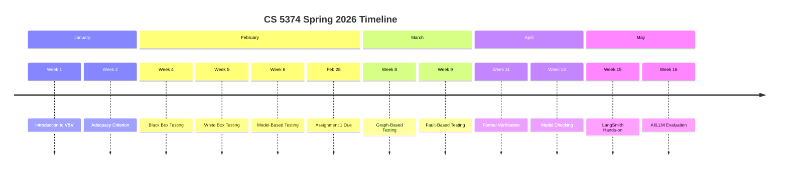

---

## Contact Information

| Role | Name | Contact |
|------|------|---------|
| **Instructor** | Dr. Akbar S. Namin | akbar.namin@ttu.edu |
| **TA 1** | Sonali Singh | sonalsin@ttu.edu |
| **TA 2** | Hasan Al-Qudah | halqudah@ttu.edu |

---

## Resources

### Primary Textbook

- **Introduction to Software Testing** — Paul Ammann & Jeff Offutt  
  [https://cs.gmu.edu/~offutt/softwaretest/](https://cs.gmu.edu/~offutt/softwaretest/)

### AI/LLM Resources

- [LangSmith Documentation](https://docs.smith.langchain.com/)
- [LangGraph Documentation](https://langchain-ai.github.io/langgraph/)
- [LangSmith Cookbook](https://github.com/langchain-ai/langsmith-cookbook)

---

*Texas Tech University • Department of Computer Science • Spring 2026*
