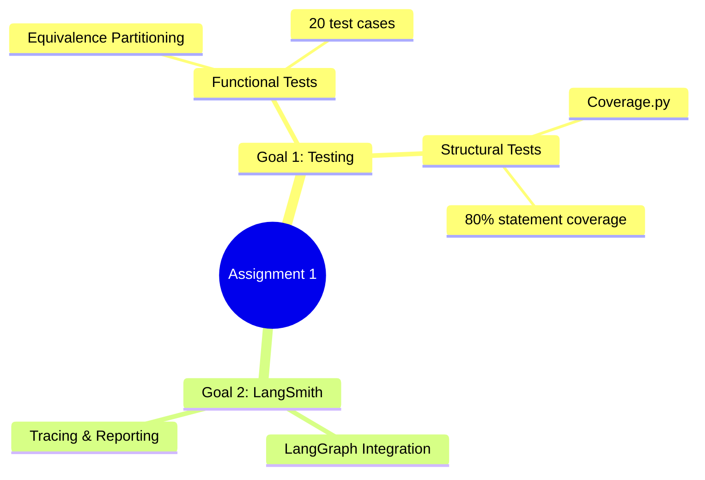
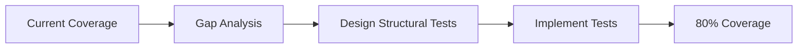
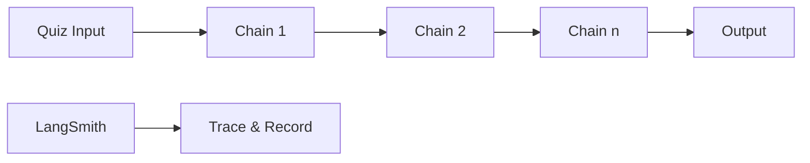

# Assignment 1: Functional + Structural Testing + LangSmith

> **Texas Tech University**  
> Department of Computer Science  
> CS5374 – Software Verification and Validation  
> Spring 2026

---

## Assignment Overview

| Attribute | Value |
|-----------|-------|
| **Type** | Individual Assignment |
| **Due Date** | February 28 (Midnight) |
| **Submission** | Canvas only |
| **Marks** | 9 (on-campus) / 10 (distance) |

---

## Goals



---

# Part A: Functional/Structural Testing (8 marks)

## Repository

$$
\text{Repository: } \texttt{https://github.com/AutomationPanda/shopping-cart-unit-tests}
$$

**Contents:**
- Shopping cart implementation (Python)
- Existing test suite

---

## Deliverables

### 1. Installation & Execution (1 mark)

**Tasks:**
- Clone the repository
- Install dependencies
- Execute the code
- Provide execution snapshots

### 2. Execute Existing Tests (1 mark)

**Tasks:**
- Run the provided test suite
- Document test results
- Provide execution snapshots

### 3. Baseline Coverage Measurement (1 mark)

**Tool:** Coverage.py

```bash
coverage run -m pytest
coverage report
coverage html
```

**Deliverable:** Statement coverage percentage of existing tests.

### 4. Design 20 Functional Tests (2 marks)

**Technique:** Equivalence Partitioning

**Format:**

| Source Code | TC# | EP Class | Valid/Invalid | Test Inputs | Expected Output | Status |
|-------------|-----|----------|---------------|-------------|-----------------|--------|
| file.py | 1 | ... | Valid | ... | ... | pass/fail |
| file.py | 2 | ... | Invalid | ... | ... | pass/fail |

### 5. Implement 20 Functional Tests (1 mark)

**Framework:** unittest (Python)

```python
import unittest

class TestShoppingCart(unittest.TestCase):
    def test_ep_class_1(self):
        # Test implementation
        pass
```

### 6. Coverage After Functional Tests (0.5 marks)

**Task:** Measure statement coverage after adding functional tests.

**Deliverable:** Updated coverage report.

### 7. Structural Tests for 80% Coverage (1 mark)

**Goal:** Achieve 80% statement coverage



**Strategies:**
- Identify uncovered statements
- Design tests to exercise those paths
- Focus on boundary conditions

### 8. Final Coverage Measurement (0.5 marks)

**Requirement:** Statement coverage ≥ 80% of reachable code

**Deliverable:** Final coverage report showing ≥ 80%

---

## Part A Summary

| Deliverable | Marks |
|-------------|-------|
| 1. Installation & snapshots | 1.0 |
| 2. Execute existing tests | 1.0 |
| 3. Baseline coverage | 1.0 |
| 4. Design 20 EP tests | 2.0 |
| 5. Implement 20 tests | 1.0 |
| 6. Coverage after functional tests | 0.5 |
| 7. Structural tests design | 1.0 |
| 8. Final 80% coverage | 0.5 |
| **Total** | **8.0** |

---

# Part B: LangSmith Tracing (2 marks)

## Task

Implement Quiz 1 in LangChain and trace execution using LangSmith.

---

## Deliverables

### 1. Source Code (0.5 marks)

**Requirements:**
- LangChain implementation of Quiz 1
- LangSmith tracing enabled

```python
import os
os.environ["LANGCHAIN_TRACING_V2"] = "true"
os.environ["LANGCHAIN_API_KEY"] = "your-api-key"
```

### 2. Execution Screenshot (0.5 marks)

**Deliverable:** Screenshot showing quiz execution output.

### 3. LangSmith Tracing Report (1 mark)

**Deliverables:**
- Screenshot(s) of LangSmith trace
- Report on number of chains executed



---

## Part B Summary

| Deliverable | Marks |
|-------------|-------|
| 1. Source code with tracing | 0.5 |
| 2. Execution screenshot | 0.5 |
| 3. LangSmith trace report | 1.0 |
| **Total** | **2.0** |

---

## Submission Checklist

- [ ] All snapshots for Part A deliverables
- [ ] EP test specification table
- [ ] Test implementation code
- [ ] Coverage reports (baseline, after functional, final)
- [ ] LangSmith-enabled Quiz 1 source code
- [ ] Execution screenshots
- [ ] LangSmith tracing report

---

## Coverage Tools Reference

| Tool | Command | Output |
|------|---------|--------|
| Coverage.py | `coverage run -m pytest` | Run tests with coverage |
| Coverage.py | `coverage report` | Text report |
| Coverage.py | `coverage html` | HTML report |

---

*CS5374 – Software Verification and Validation | Texas Tech University*
