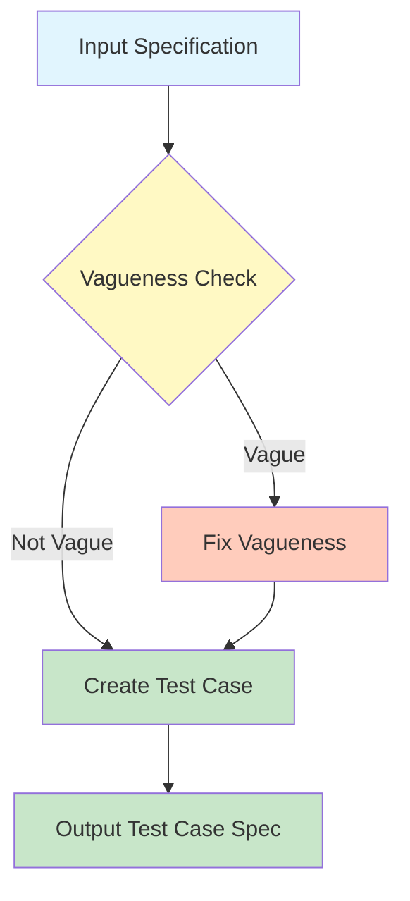
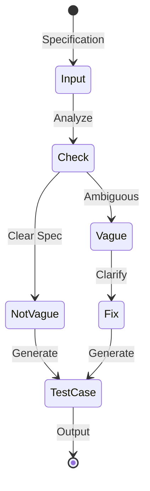
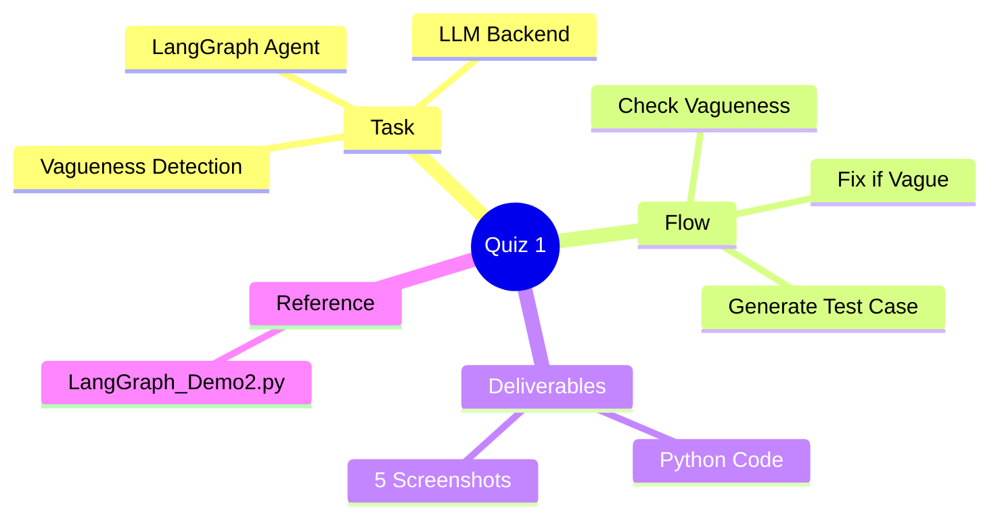

# Quiz 1: LangGraph Vague Specification Detection Agent

> **CS 5374 – Software Verification and Validation**  
> Texas Tech University  
> Bonus Quiz (1 Mark)

---

## Problem Statement

Build a **LangGraph agent** (with LLM backend) that:

1. Takes a short specification as input
2. Determines whether the specification is **vague** or **not vague**
3. **If not vague:** Creates a test case specification based on the input
4. **If vague:** Transforms it to a precise specification, then creates a test case

---

## System Architecture



---

## Vague Specification Examples

| # | Domain | Vague Specification | Issue |
|---|--------|---------------------|-------|
| 1 | Software Development | "The system shall allow for fast, easy data entry" | Defines neither "fast" nor "easy" |
| 2 | Construction | "Install high-quality flooring" | No materials, brand, or durability standard |
| 3 | Performance | "The application must be secure" | Lacks security protocols, compliance, or threat models |
| 4 | Reporting | "The report will include, as appropriate, investigation findings" | Scope open to interpretation |
| 5 | Project Timeline | "The project will be completed in a timely manner" | No specific deadline |

---

## Expected Behavior

### Workflow



### Output Format

**For Non-Vague Specifications:**

```
Test Case Specification:
- Input: [specific inputs]
- Expected Output: [expected behavior]
- Preconditions: [required conditions]
```

**For Vague Specifications:**

```
Clarified Specification: [precise version]

Test Case Specification:
- Input: [specific inputs]
- Expected Output: [expected behavior]
- Preconditions: [required conditions]
```

---

## Implementation Reference

**Hint:** Reference `LangGraph_Demo2.py` (available on Canvas)

### Key Components

| Component | Purpose |
|-----------|---------|
| **Input Node** | Accept specification text |
| **Vagueness Check Node** | LLM-based classification |
| **Fix Node** | Transform vague to precise |
| **Test Case Node** | Generate test specification |
| **Router** | Conditional edge based on vagueness |

### Suggested Code Structure

```python
from langgraph.graph import StateGraph, END
from typing import TypedDict

class State(TypedDict):
    specification: str
    is_vague: bool
    clarified_spec: str
    test_case: str

def check_vagueness(state: State) -> State:
    # LLM call to determine vagueness
    pass

def fix_vagueness(state: State) -> State:
    # LLM call to clarify specification
    pass

def generate_test_case(state: State) -> State:
    # LLM call to create test case spec
    pass

# Build graph
graph = StateGraph(State)
graph.add_node("check", check_vagueness)
graph.add_node("fix", fix_vagueness)
graph.add_node("testcase", generate_test_case)
```

---

## Submission Requirements

### Rubric (Total: 2 marks)

| Deliverable | Marks |
|-------------|-------|
| Source code (Python) | 1.0 mark |
| 5 Screenshots of outputs for test inputs | 1.0 mark (0.2 each) |

### Test Inputs

Use the 5 vague specification examples provided above.

### Submission

- **Platform:** Canvas only
- **Deadline:** 12:30 PM (submission entry disabled after)

---

## Quick Reference



---

*CS5374 – Software Verification and Validation | Texas Tech University*
